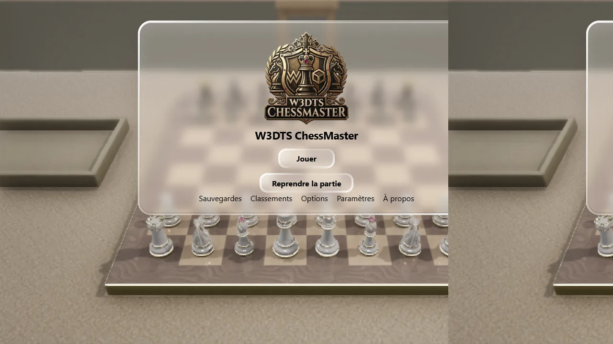
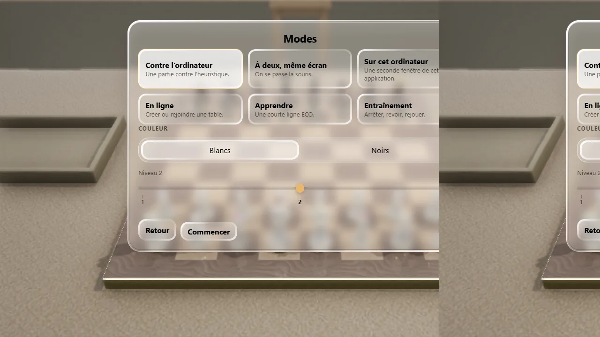
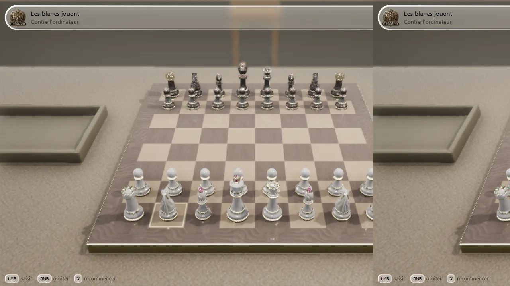
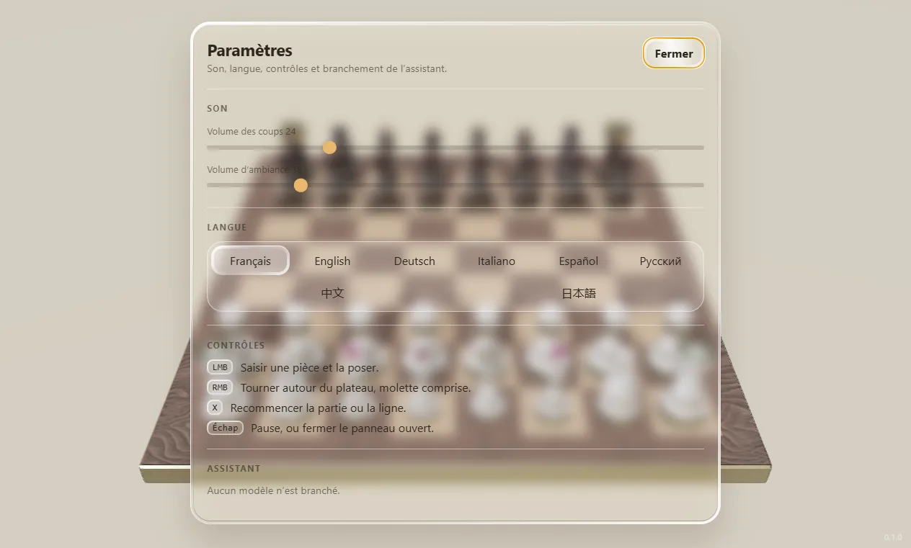

# W3DTS ChessMaster

Une table d’échecs en 3D. On saisit les pièces et on les pose.

## Jouer

- Contre l’ordinateur.
- À deux, la même souris.
- Une seconde fenêtre sur ce poste.
- Deux machines, avec un code de table.
- Une courte ouverture à apprendre.

Les classements affichés sont des exemples.

## Langues

Français, English, Deutsch, Italiano, Español, Русский, 中文, 日本語. Le français est la langue de départ.

## Assistant

Il commente la position. Il ne joue pas.

L’image se règle, du plus fluide au plus détaillé.

Compiler et lancer : [docs/build.md](docs/build.md).

Le code source est sous licence propriétaire. Voir [LICENSE](LICENSE).

Moteur : [naanouff/w3dts](https://github.com/naanouff/w3dts).
