# Ambiances du plateau

Cinq décors autour du même damier. Chacun pose l’échiquier sur une table, dans une pièce construite. L’HDRI éclaire et se reflète. Elle ne remplace pas le décor.

Le jeu pose encore le damier sur un plan de 4,2 m, toile crème, sous une seule HDRI. Ce plan, `ChessStudioCloth` dans [ChessDemoProject.ts](../src/renderer/host/ChessDemoProject.ts), disparaît dans les cinq niveaux. Le plateau et les pièces restent en monde fixe (blanc −Z). La caméra de partie blanche reste à l’œil `[0, 0,55, −0,72]`, FOV 38°, far 20 m ; quand le joueur local est noir, la même pose miroite sur Z pour mettre ses pièces au premier plan. Le découpage est [CHESS-B26](sprints/CHESS-B26.md).

Les 64 cases restent la zone la plus claire. L’ambiance vit autour, jamais sur les cases. Les surbrillances de coups légaux gardent leur couleur. Le son de prise et le lit de pièce sont dans [audio.md](audio.md).

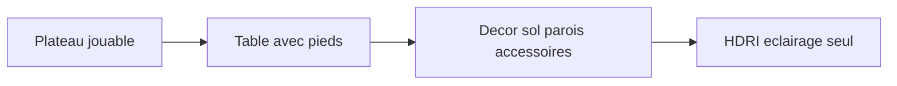
```mermaid
flowchart LR
  board[Plateau jouable]
  table[Table avec pieds]
  set[Decor sol parois accessoires]
  ibl[HDRI eclairage seul]
  board --> table --> set --> ibl
```

- **Table.** Un meuble, pas un plan infini. Le dessus est à 74 cm du sol, pour garder la caméra actuelle. Le damier s’y pose : 48 cm de cases, 55 cm avec le cadre, 2,4 cm d’épaisseur. Le cimetière est sur la table.
- **Décor.** Sol, au moins trois parois ou un équivalent (balustrade, pergola), et quatre à huit accessoires lisibles à 2–6 m. Rien ne masque une case.
- **HDRI.** Éclairage et reflets seulement. Le ciel ne se voit que par une ouverture.

Même plateau, mêmes pièces, même caméra. Le preset de niveau échange la table, le décor et l’HDRI ensemble. Les illustrations ci-dessous sont la référence de modélisation. Les prompts qui les ont produites ne le sont plus.

## Atelier Kontrast

Prise de vue produit. Défaut, toutes les parties. HDRI [studio_kontrast_04_2k.hdr](../public/hdri/studio_kontrast_04_2k.hdr) en fill. La softbox est une surface émissive, elle ne remplace pas le soleil.

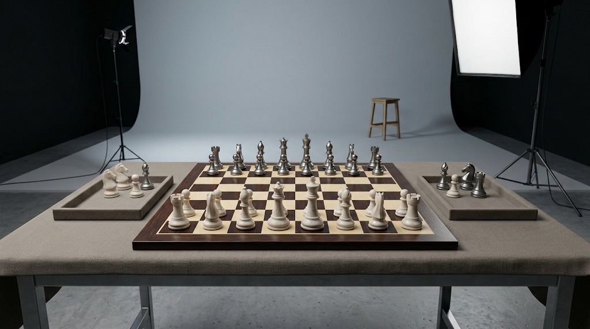

Cases ivoire et wengé, cadre foncé. Blancs marbre ou ivoire mat, noirs acier brossé, déjà dans [chessLook.ts](../src/renderer/host/chessLook.ts). La prise fait un clic sec. L’échec ajoute un filet de bloom sur la pièce seule.

La caméra de partie reste basse et proche. Deux cyclos se font face (+Z et −Z). Les props de fond (tabouret, cheminée, bar, banc…) sont mirroirés sur Z ; on n’affiche que la bande loin de la caméra selon blanc ou noir ([CHESS-B27](sprints/CHESS-B27.md)). Softbox et projecteur restent latéraux (partagés) ; deux fills derrière chaque caméra éclairent les faces vues.

**Table studio** — 180 × 100 cm, toile lin beige, retombée de 4 cm, pieds en tube d’acier carré, entretoise basse.

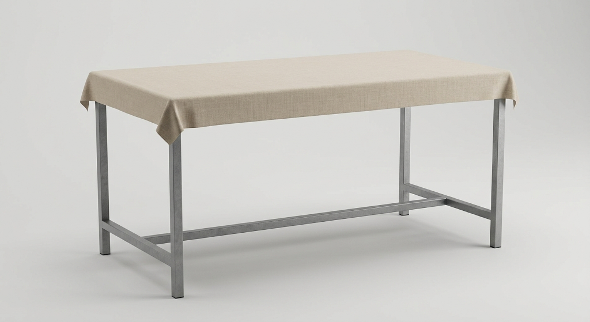

**Plateau toile** — 28 × 18 × 3 cm, même lin, bords relevés, vide. Deux instances, gauche et droite. Au jeu, les blancs pris vont à gauche et les noirs à droite.

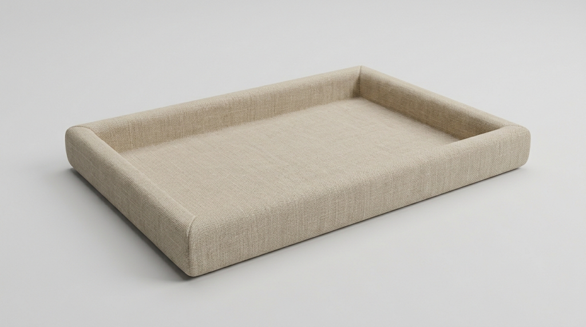

**Cyclorama** — 6 m de large, 3 m de haut, plâtre gris mat. Le sol du cyclo remonte en quart de cercle, rayon 80 cm. Deux instances procédurales : une à +Z (fond côté noirs pour la caméra blanche), une à −Z (fond côté blancs pour la caméra noire). Le béton sous la table est un autre plan. Le GLB Meshy est à l’envers : on ne charge pas `cyclorama.glb`.

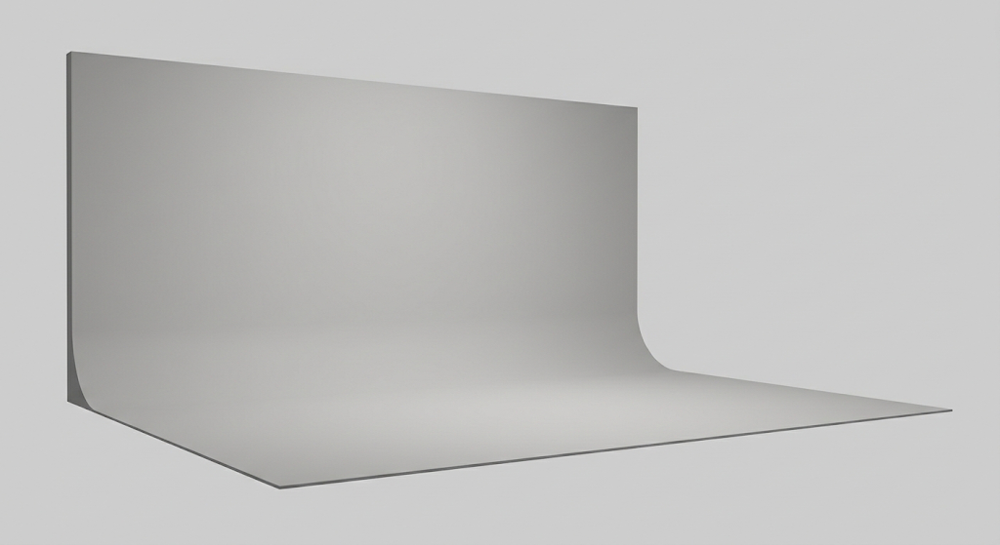

**Softbox** — Face blanche 80 × 120 cm, pied noir, câble, à droite.

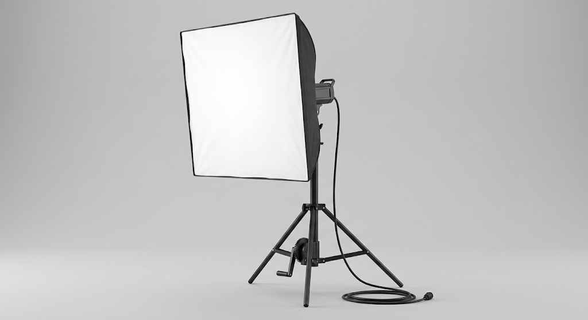

**Pied de projecteur** — Pied noir, petite tête nue, câble, à gauche.

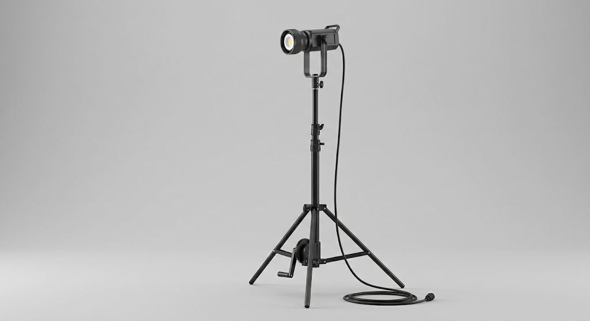

**Tabouret** — Bois clair, assise carrée, 45 cm. Petit, au fond du cyclo.

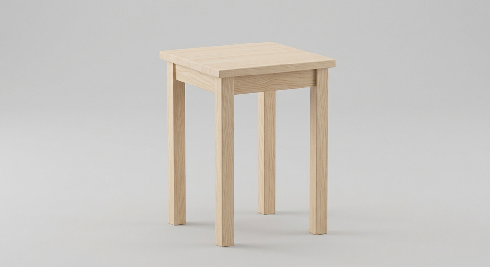

### Maîtres Meshy

Les six meshes texturés sont dans `docs/raw_assets/atelier/`. Ce sont des GLB locaux, ignorés par git, comme les pièces. Chacun porte une couleur, une carte métal/rugosité et une normale en JPEG 2048. Le nombre de sommets va de 2 300 à 5 300. Au nettoyage (`pnpm clean:set-props`), toutes les props Meshy reçoivent le lissage de normales à 60° (`MESHY_NORMAL_CREASE`). Les dumps bruts restent facettés ; les bakes et `public/sets` sont lisses. Audit : `node scripts/audit-set-normals.mjs` (bakes) ou `--masters` (dumps).

Meshy a normé chaque objet pour que son plus grand côté fasse 1. Avant la scène, on remet l’échelle du document : table 1,80 m, plateau 0,28 m, cyclorama 6 m de large, softbox 1,20 m de face, tabouret 0,45 m de haut. Le projecteur suit la hauteur de son pied, calée à 1,60 m.

Le facteur métallique du matériau vaut 1, et la métalité réelle est dans la texture. Au chargement, la texture commande. Sinon les six objets deviennent chromés.

| Fichier | Prop | Source Meshy |
| --- | --- | --- |
| `table.glb` | Table lin, pieds tube carré | `1006171458` |
| `plateau-toile.glb` | Plateau du cimetière | `1004065211` |
| `tabouret.glb` | Tabouret bois, un peu plus chaud que la photo | `1004065135` |
| `softbox.glb` | Softbox et pied | `1004065155` |
| `projecteur.glb` | Pied de projecteur | `1004065202` |
| `cyclorama.glb` | Cyclo gris. Le fichier Meshy s’appelait Curved Metal Sheet ; l’albédo est un gris neutre et le canal métal est proche de zéro | `1004065232` |

## Salon de minuit

Pièce close, partie lente. Lieu du coach et des parties classiques. La lampe est la key, teinte ambre, ombres vers la droite. La cheminée est un rim faible derrière les pièces du fond. HDRI monochrome en gain bas : les murs cachent le ciel. Poussière dans le cône de la lampe. Bloom sur l’abat-jour et l’âtre.

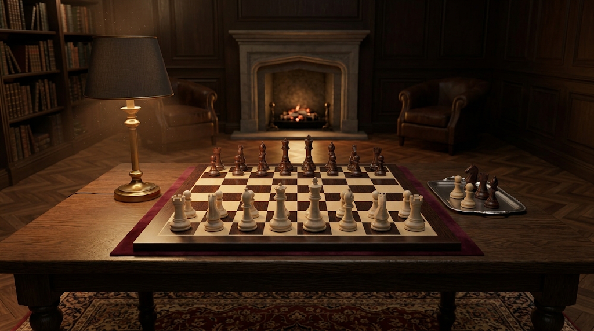

Cases buis et ébène, vernis mat. Pièces buis clair et bois foncé, via [WoodProceduralPBR.json](../public/shader-graphs/WoodProceduralPBR.json). La prise est un bois feutré. L’échec fait vaciller l’intensité de la lampe, pas la caméra.

La lampe reste au coin arrière gauche, pour ne pas couvrir la colonne a.

**Table chêne** — 160 × 90 cm, chant de 6 cm, quatre pieds tournés.

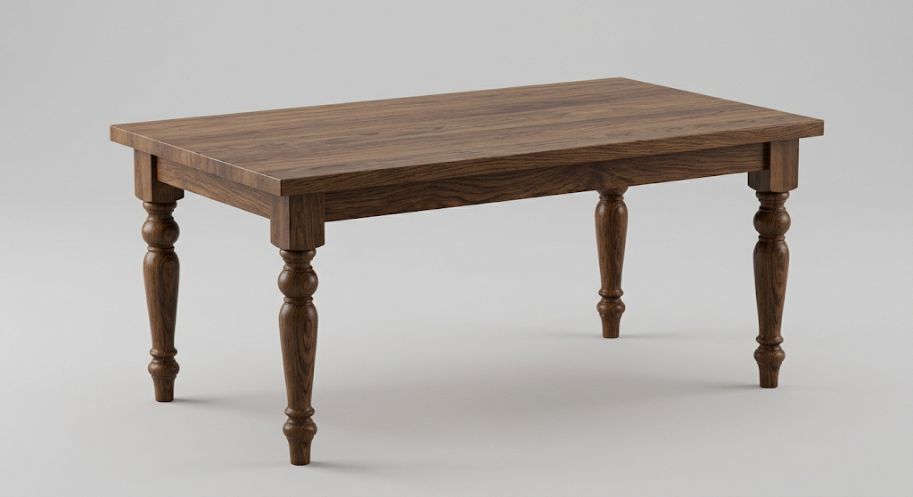

**Napperon** — Velours bordeaux, 70 × 70 cm, à plat, sans frange.

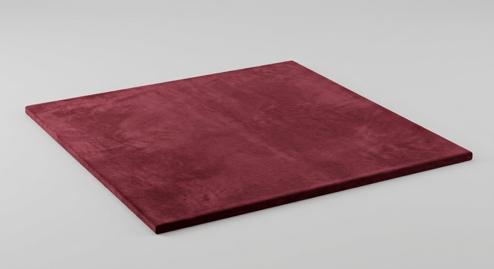

**Plateau argent** — Ovale 32 × 22 cm, argent mat, à droite sur le bois nu. Les pièces prises s’y rangent par couleur.

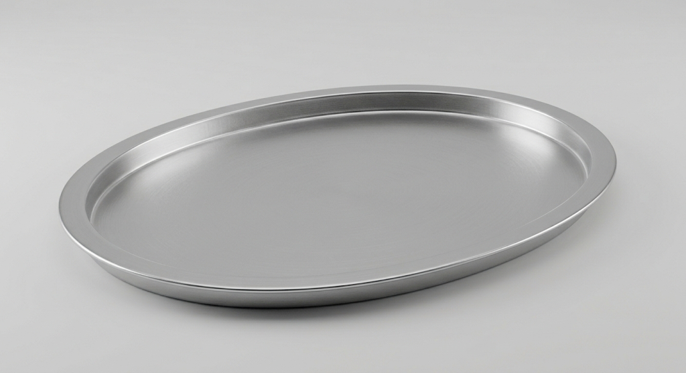

**Lampe** — Laiton, abat-jour gris, 45 cm, ampoule sous l’abat-jour.

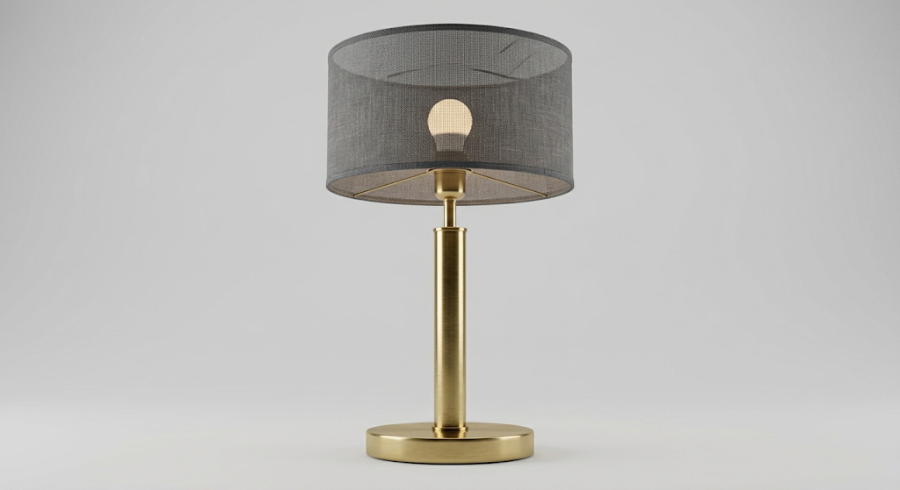

**Cheminée** — Pierre claire, 140 × 120 cm, bûches. Le feu est une lumière, pas une texture.

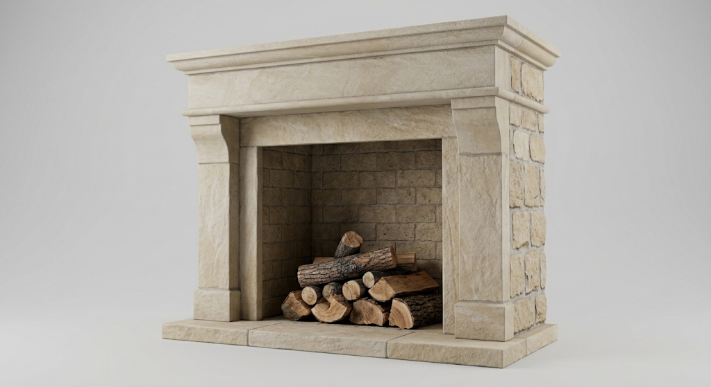

**Fauteuil** — Cuir brun, pieds bois. Un mesh, deux instances, de part et d’autre de la cheminée.

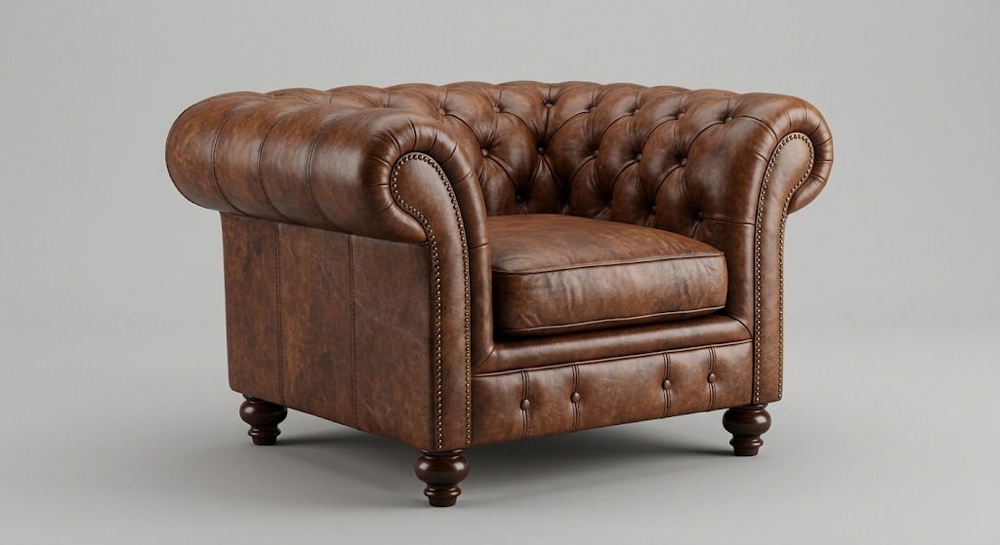

**Bibliothèque** — Chêne sombre, 220 cm, livres sans titre lisible, sur le mur gauche.

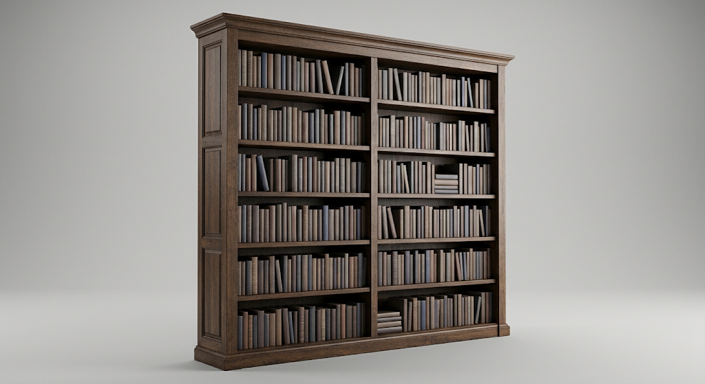

**Tapis** — 200 × 140 cm, motif rouge et beige, frange comprise, sous la table. Jamais sous les cases.

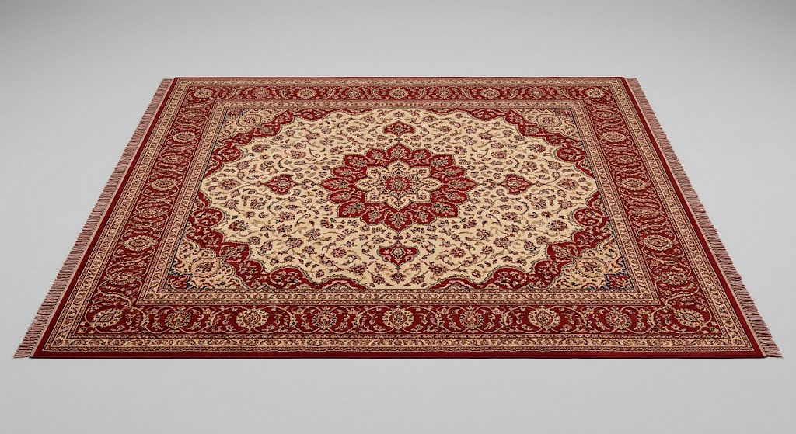

**Dalle parquet** — Module de parquet en chevron, chêne sombre satiné, déjà à plat, 230 triangles. Les quatre bords se rejoignent sans couture. Répétée sous le tapis et autour.

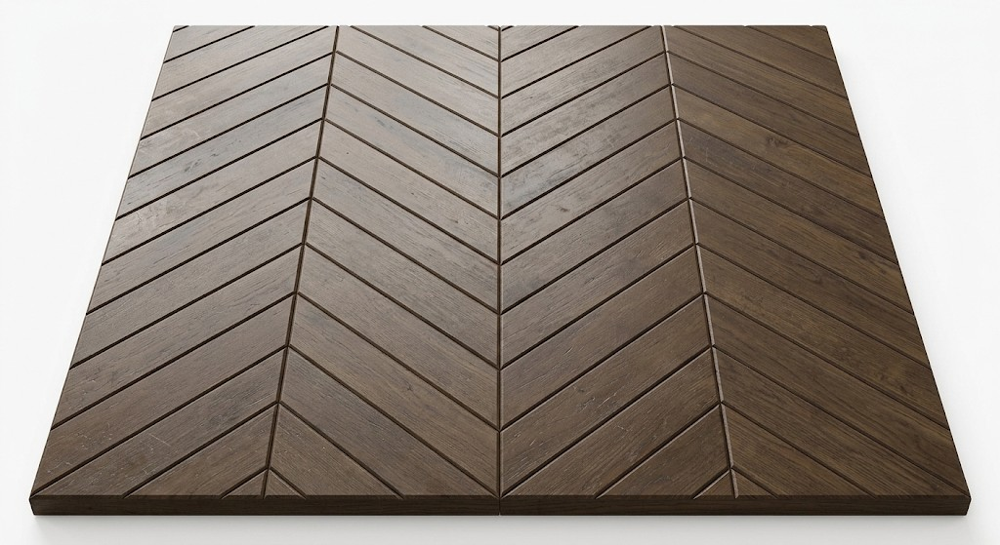

Prompt Meshy :

```text
A single seamless tileable oak herringbone parquet floor module, one square panel whose four edges match when repeated in a grid with no visible seam, classic French chevron pattern that continues across tile borders, dark warm oak, worn satin finish, subtle grain, thin chamfered board edges, already lying flat face up, thin slab about 2 cm thick, game-ready low poly under 500 triangles, PBR textured, no unique center motif, no furniture, no rugs, isolated on white background
```

### Maîtres Meshy

Les neuf meshes texturés sont dans `docs/raw_assets/salon/`. Même contrat que l’atelier : GLB locaux, hors git, couleur et normale en JPEG 2048. Meshy a encore normé le grand côté à 1. Le facteur métallique vaut 1 : la texture commande.

| Fichier | Prop | Échelle | Source Meshy |
| --- | --- | --- | --- |
| `table.glb` | Chêne, pieds tournés | Longueur 1,60 m. La hauteur tombe alors vers 67 cm, la profondeur vers 88 cm | `1007040151` |
| `napperon.glb` | Velours bordeaux, carré, très plat | 70 cm de côté | `1004071932` |
| `plateau.glb` | Plateau ovale argent | Grand axe 32 cm | `1004071937` |
| `lampe.glb` | Laiton et abat-jour gris | Hauteur 45 cm | `1004071926` |
| `cheminee.glb` | Pierre et bûches. Le feu reste une lumière | Largeur 1,40 m. La hauteur tombe vers 1,12 m | `1004071829` |
| `fauteuil.glb` | Chesterfield marron. Deux instances | Hauteur vers 78 cm, largeur vers 1,26 m | `1004071919` |
| `bibliotheque.glb` | Chêne et livres, sans titres. Le mesh est plus large que haut | Hauteur 2,20 m, ce qui donne environ 2,56 m de large et 46 cm de profondeur | `1004071822` |
| `tapis.glb` | Motif rouge et beige. Le mesh est carré, pas 200 × 140 | 2 m de côté, sous la table | `1004072006` |
| `dalle.glb` | Module chevron, face usée, déjà à plat. 230 triangles | 80 cm de côté, épaisseur vers 3,9 cm | `1009060334` |

## Terrasse d’hiver

Dehors, heure bleue. Pour les finales. Dalles mouillées qui portent le ciel. Brouillard dense derrière la balustrade, presque absent sur le damier. Une lanterne est allumée : le verre émet.

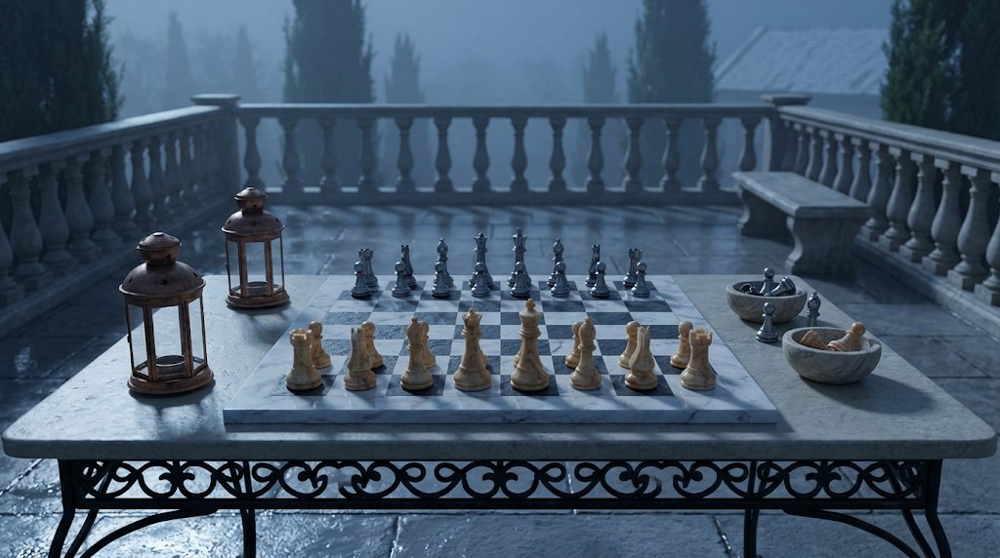

Cases marbre veiné et ardoise, bord sombre pour ne pas se fondre dans la pierre. Pièces marbre chaud contre acier froid. La prise sonne pierre. La promotion pose un rayon plus chaud, bref, sur la nouvelle pièce.

**Table fer et pierre** — Plateau calcaire 130 × 80 × 4 cm, tablier et pieds en fer forgé.

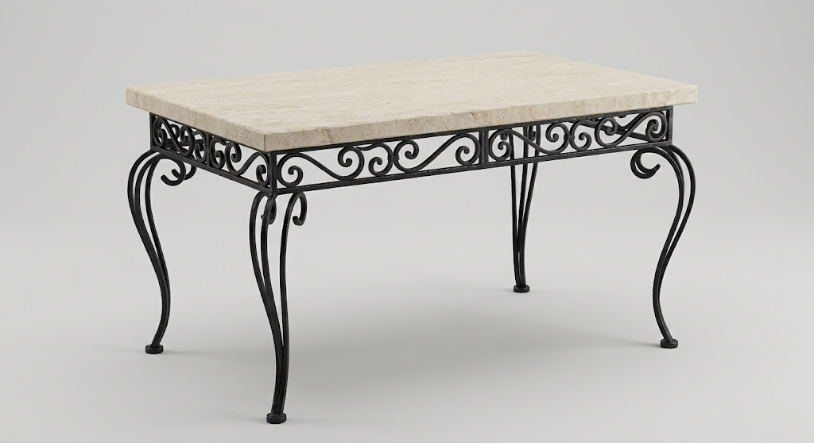

**Lanterne** — Carrée, cuivre au vert-de-gris, verre allumé, 28 cm. Une instance, à droite du plateau.

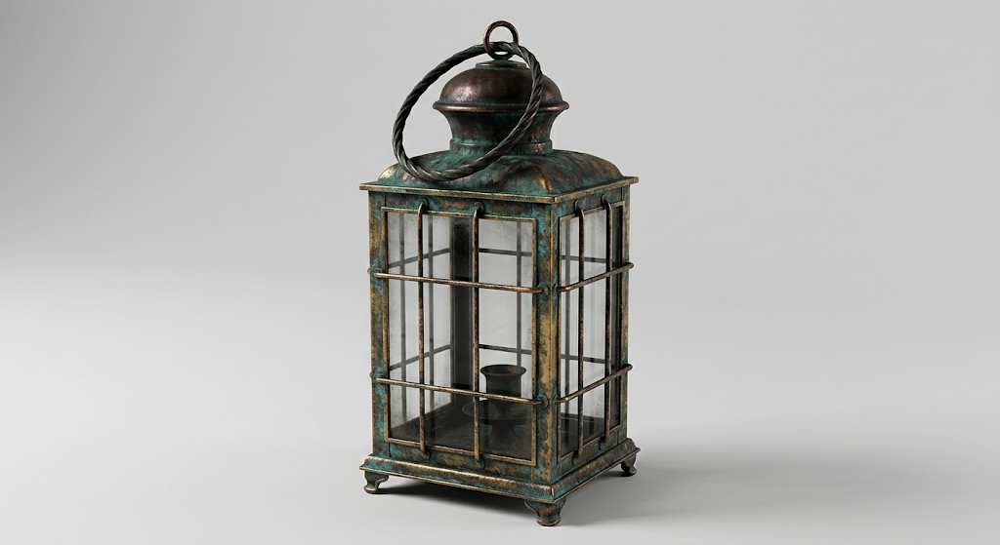

**Coupe de pierre** — Marbre, diamètre 16 cm, vide. Deux instances, une par couleur, à droite.

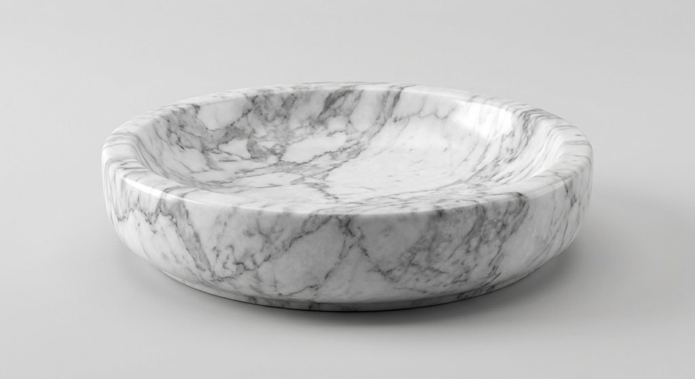

**Travée de balustrade** — 120 cm de long, 90 cm de haut. Répétée sur trois côtés. Pas de mur plein.

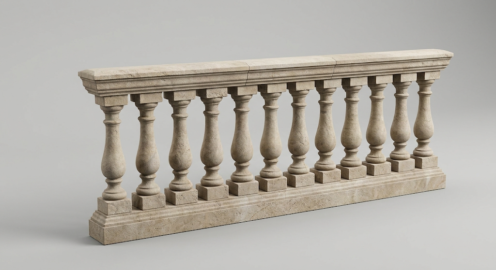

**Banc de pierre** — 160 cm, dossier bas, contre la balustrade de droite.

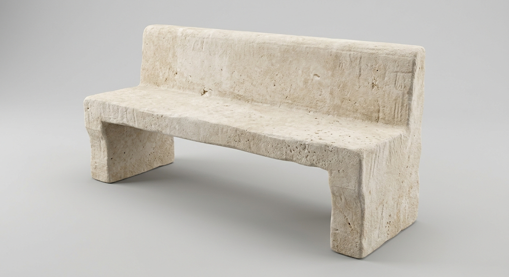

**Dalle de pierre** — Ardoise, face usée, film d’eau. Le mesh est déjà à plat, presque carré, 440 triangles. Répétée sur la terrasse.

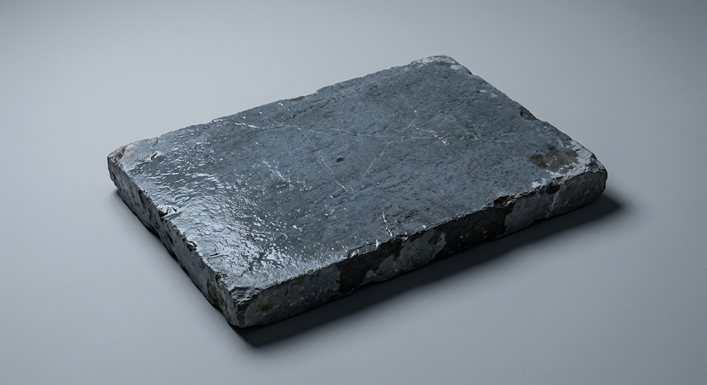

**Cyprès** — Environ 6 m. On modélise celui de droite, au tronc visible. Le plus étroit, à gauche, est la même essence en variante lointaine. Instancié au-delà de la balustrade, flou. Pas encore de fichier.

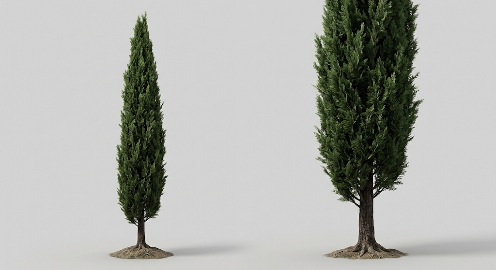

### Maîtres Meshy

Six meshes sont dans `docs/raw_assets/terrasse/`. Même contrat que l’atelier : GLB locaux, hors git, couleur, métal/rugosité et normale en JPEG. Meshy a normé le grand côté à 1. Le facteur métallique vaut 1. Le verre de la lanterne émet une lueur chaude. Le cuivre reste sombre. Le cyprès n’a pas de fichier.

| Fichier | Prop | Échelle | Source Meshy |
| --- | --- | --- | --- |
| `table.glb` | Calcaire, pieds fer forgé | Longueur 1,30 m. La profondeur tombe vers 79 cm, la hauteur, pieds compris, vers 68 cm | `1006190031` |
| `lanterne.glb` | Cuivre vert-de-gris. Seul le verre émet | Hauteur 28 cm. Le côté tombe vers 14 cm | `1006190026` |
| `coupe.glb` | Marbre, vide, peu profonde | Diamètre 16 cm. La hauteur tombe vers 3,3 cm | `1006190017` |
| `balustrade.glb` | Pierre, une travée. L’épaisseur est en Z | Longueur 2,40 m, le double de la fiche, pour lire comme le concept. La hauteur tombe vers 92 cm, l’épaisseur vers 23 cm | `1006190005` |
| `banc.glb` | Pierre, dossier bas | Longueur 1,60 m. La hauteur tombe vers 78 cm, la profondeur vers 51 cm | `1006190011` |
| `dalle.glb` | Ardoise, face usée, déjà à plat. Le grand côté est en Z. 440 triangles | 60 cm. La largeur tombe vers 58 cm, l’épaisseur vers 6,8 cm | `1009043939` |

## Club néon

Sous-sol, partie rapide. HDRI [neon_photostudio_2k.hdr](../public/hdri/neon_photostudio_2k.hdr) en fill, gain 0,9. Pas de jour. Bloom sur les tubes et sur la lueur de coup, pas sur les cases.

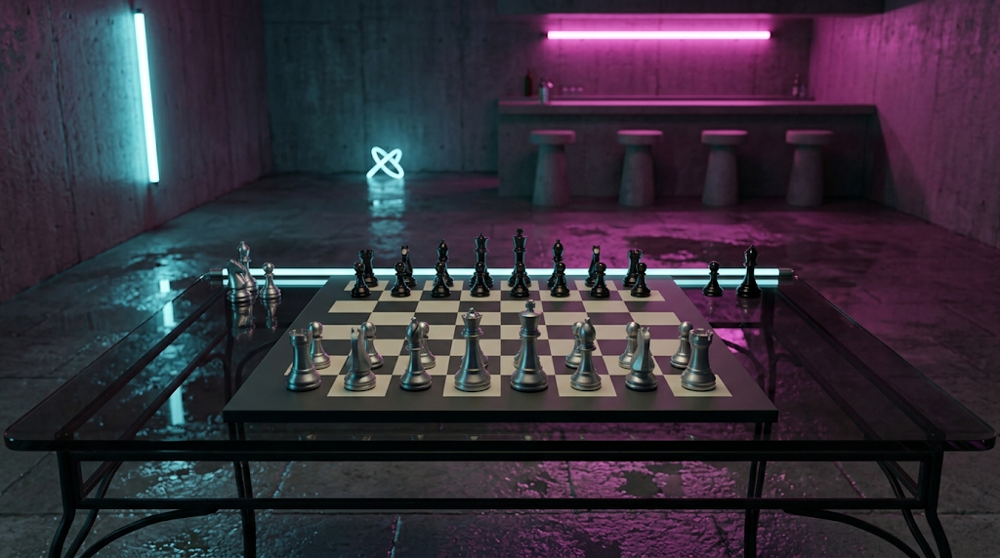

Cases graphite mat et ivoire, cadre sombre, sans reflet. Blancs acier, noirs obsidienne. Le coup légal garde la lueur néon actuelle. L’échec fait monter le tube cyan du mur, pas le rail. Au mat, les enseignes s’éteignent et une petite lampe reste sous le roi.

La maquette ne place pas le rail cyan sous la table.

**Table verre** — 160 × 90 cm, hauteur 74 cm, verre fumé, pieds fins, entretoise courbe. Le damier mat est posé dessus. Le GLB Meshy est un bloc opaque : la maquette dessine la table, elle ne charge pas `table.glb`.

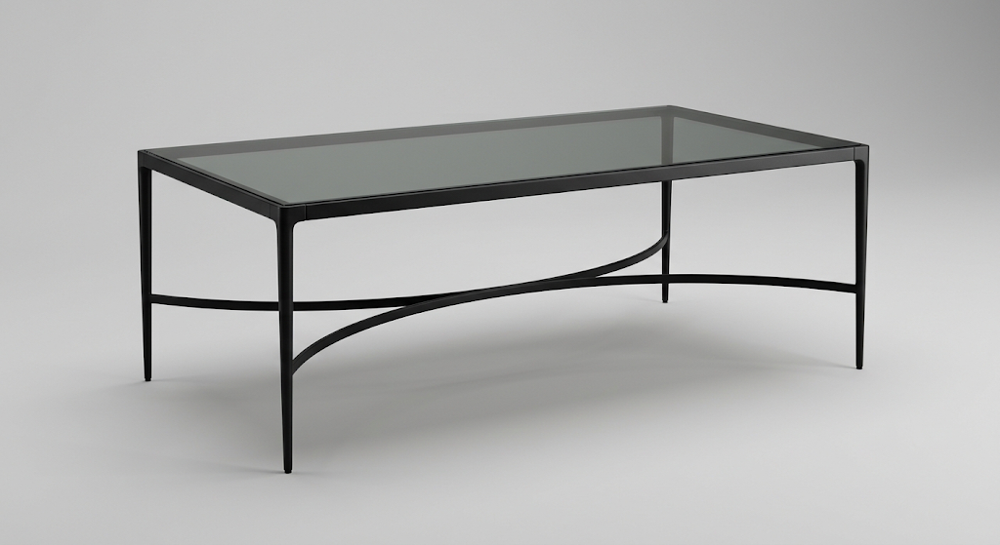

**Rail cyan** — 70 cm, diamètre 2 cm, culots métal, émissif cyan.

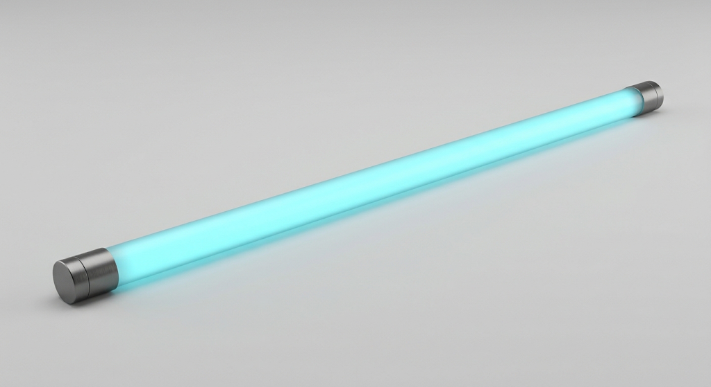

**Bar** — Béton, 110 cm de haut, plan de travail plus clair, retour en L à droite.

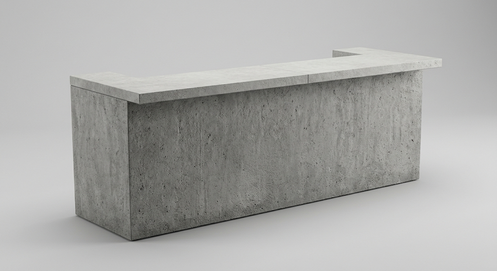

**Tabouret** — Cylindre de béton, assise ronde, 45 cm. Trois instances.

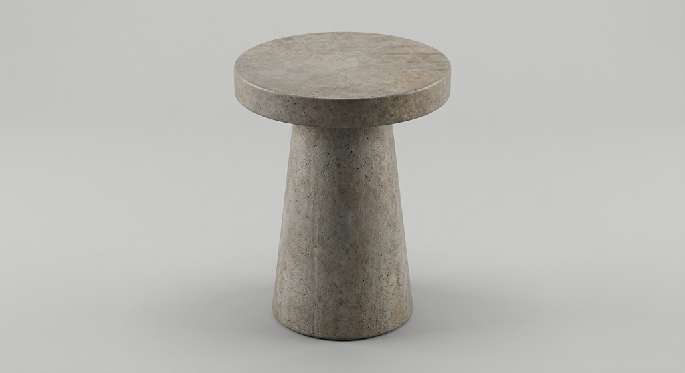

**Tube néon** — 120 cm, verre clair, culots métal. Un mesh, teinté ensuite : cyan à la verticale sur le mur gauche, magenta à l’horizontale au-dessus du bar.

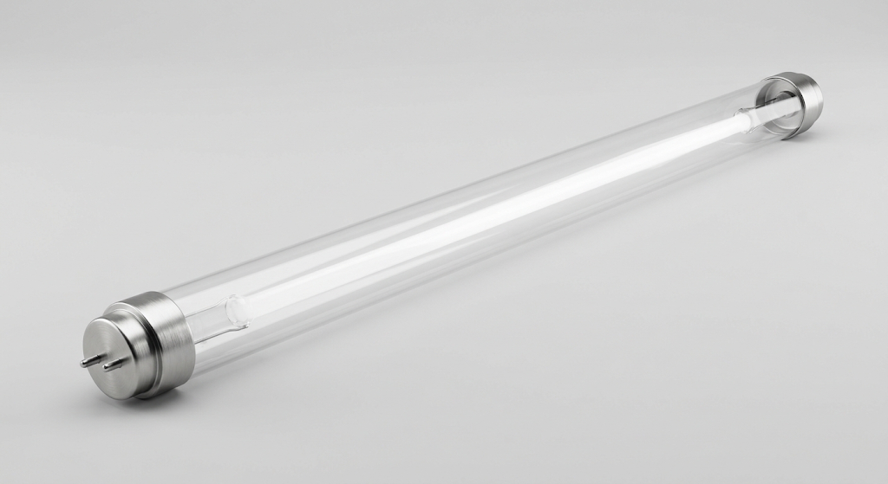

**Enseigne abstraite** — Nœud de tubes cyan, aucun caractère. Elle remplace le petit signe du concept de scène.

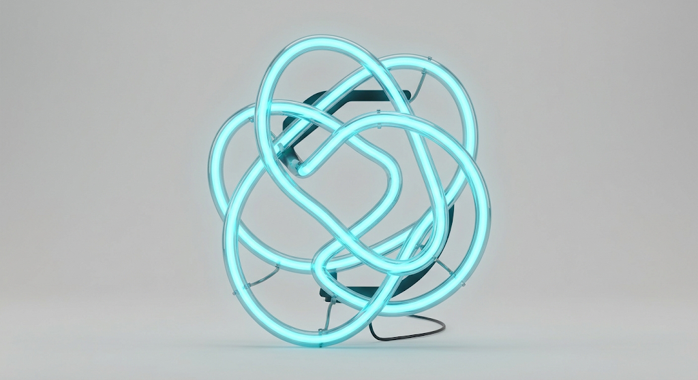

**Bouteilles** — Trois verres sombres, bouchons noirs, sans étiquette, sur le bar.

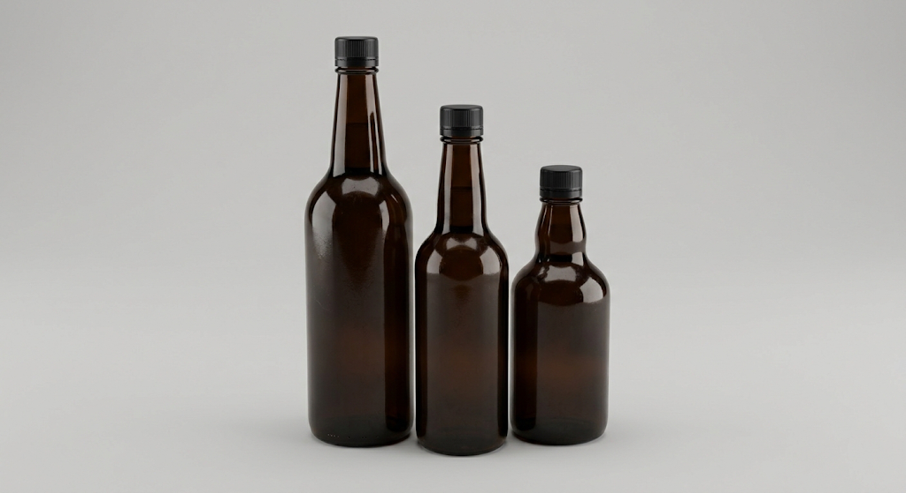

**Dalle béton** — Carré 1 × 1 m, béton mouillé, joint de dilatation en rainure sur les quatre bords. Déjà à plat, 208 triangles. Les faces et les joints se répètent en grille. Répétée sur le sol.

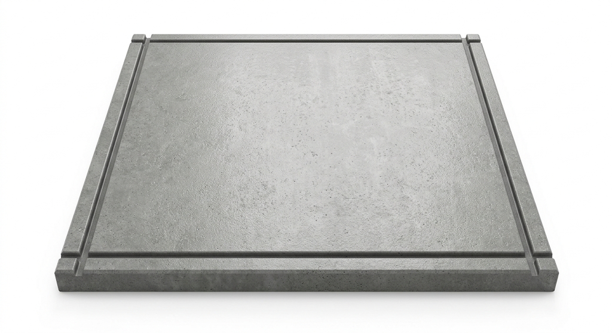

Prompt Meshy :

```text
A single seamless tileable industrial concrete floor slab, one metre square, four identical edges so the slab repeats in a grid with no visible seam, wet polished grey concrete with an even slight sheen and no unique puddle or stain in the center, recessed expansion joint groove of equal width along all four edges so abutting tiles form a continuous joint grid, already lying flat face up, about 4 cm thick, game-ready low poly under 500 triangles, PBR textured, no rebar, no debris, no furniture, isolated on white background
```

### Maîtres Meshy

Les huit meshes texturés sont dans `docs/raw_assets/club/`. Même contrat que l’atelier : GLB locaux, hors git, couleur et normale en JPEG 2048. Meshy a normé le grand côté à 1. Le facteur métallique vaut 1 : la texture commande.

Aucun des props émissifs du club n’a de texture émissive dans le GLB. Le cyan du rail, le cyan et le magenta des tubes se posent au chargement. L’enseigne a déjà un albédo cyan, mais son émission est à zéro : le bloom ne la prendra pas tant qu’on ne l’ajoute pas.

| Fichier | Prop | Échelle | Source Meshy |
| --- | --- | --- | --- |
| `table.glb` | Verre fumé, pieds fins. L’albédo est presque noir et le verre n’est pas transparent | Longueur 1,60 m. La profondeur tombe vers 84 cm, la hauteur vers 58 cm | `1004073048` |
| `rail.glb` | Tube fin, albédo gris métal. Le cyan vient ensuite | Longueur 70 cm. Le diamètre tombe vers 3 cm | `1004073019` |
| `bar.glb` | Béton, retour en L. Le fichier Meshy s’appelait Concrete Countertop | Hauteur 1,10 m, ce qui donne environ 2,80 m de long et 1,80 m de profondeur | `1004072952` |
| `tabouret.glb` | Cylindre de béton. Trois instances. Le fichier Meshy s’appelait Stone Pedestal Table | Hauteur 45 cm, emprise vers 35 cm | `1004073055` |
| `tube.glb` | Verre clair, culots métal. Un mesh, teinté ensuite | Longueur 1,20 m. Le diamètre tombe vers 8 cm | `1004073104` |
| `enseigne.glb` | Nœud cyan, sans caractère, très plat | Face 60 cm. La profondeur fait 8 % du côté | `1004073008` |
| `bouteilles.glb` | Trois verres sombres, sans étiquette | Hauteur 30 cm. Le groupe est plus haut que large | `1004072959` |
| `dalle.glb` | Béton mouillé, joint en rainure sur les quatre bords, déjà à plat. 208 triangles | 1 m de côté, épaisseur vers 5,4 cm | `1009060427` |

## Jardin suspendu

Pavillon ouvert, soirée en bord de mer. Lieu du mode apprentissage. Soleil bas et chaud, à droite de la table, horizon doré. Le damier reste sous la pergola, sans zébrures de feuilles. La flaque de soleil tombe sur les dalles au premier plan. Bloom seulement sur cette flaque.

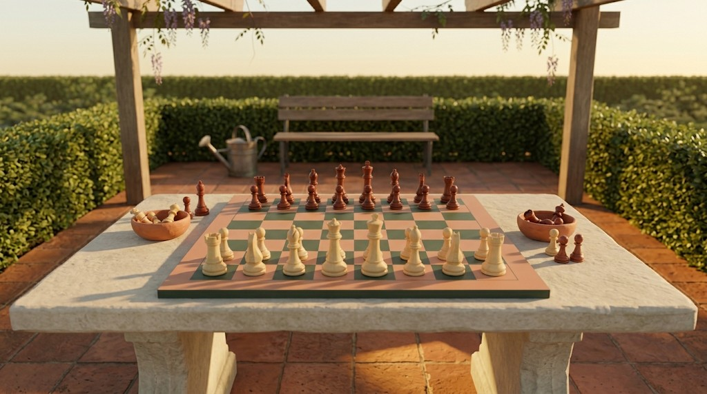

Cases terre cuite et vert jardin, cadre vert. Pièces buis clair et bois rouge, comme au salon. La prise est un bois sec, plus léger que le salon. Une ouverture réussie en mode learn rapproche un peu la tache de soleil du bord de table, sans couvrir une case.

**Table de pierre** — Plateau irrégulier 150 × 90 × 8 cm, deux pieds sculptés. Le coin de softbox en haut à gauche de l’illustration ne fait pas partie du mesh.

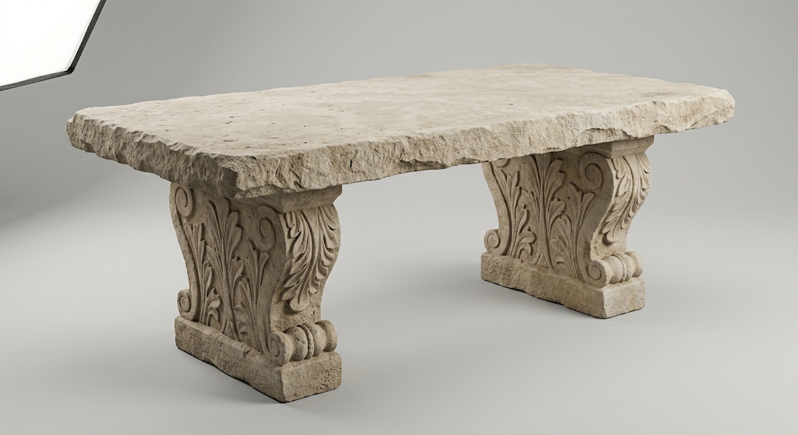

**Coupe terre cuite** — Diamètre 18 cm, vide. Deux instances : pièces claires à gauche, pièces foncées à droite. Comme tous les props Meshy, le nettoyage moyenne les normales des faces qui se rencontrent à moins de 60° (`MESHY_NORMAL_CREASE`). Le rebord plus vif reste.

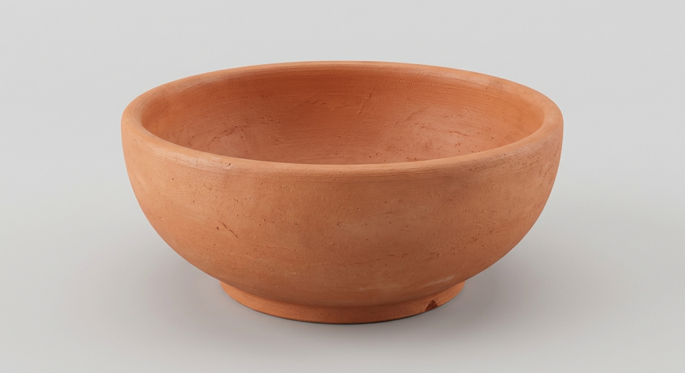

**Pergola** — Quatre poteaux, poutres et traverses. Emprise 4 × 3 m, hauteur 2,6 m. Sans feuilles. Pas de GLB : la revue la construit en cubes. Pas de bande de mer.

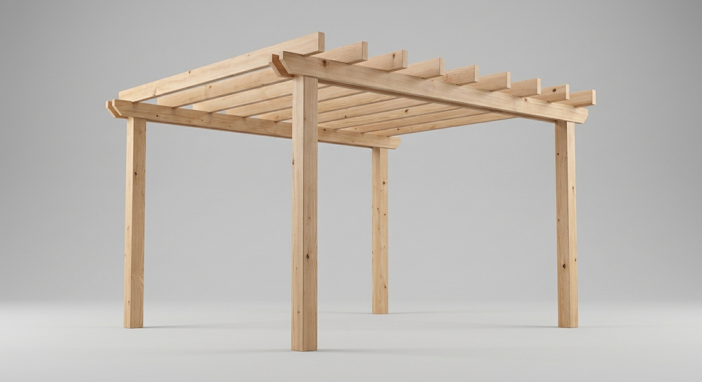

**Grappe de glycine** — Un brin, feuilles et fleurs violettes. Pas un arbre. Le mesh livré est opaque : ce n’est pas un plan alpha.

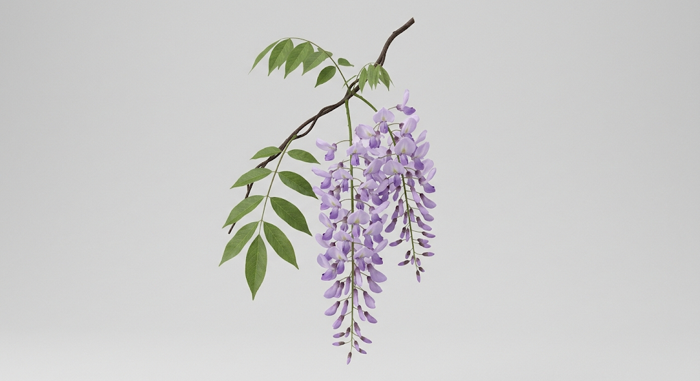

**Panneau de haie** — Buis dense, bac compris. Un pan de 2 m. La hauteur du mesh tombe vers 1,16 m. La revue ne le pose pas.

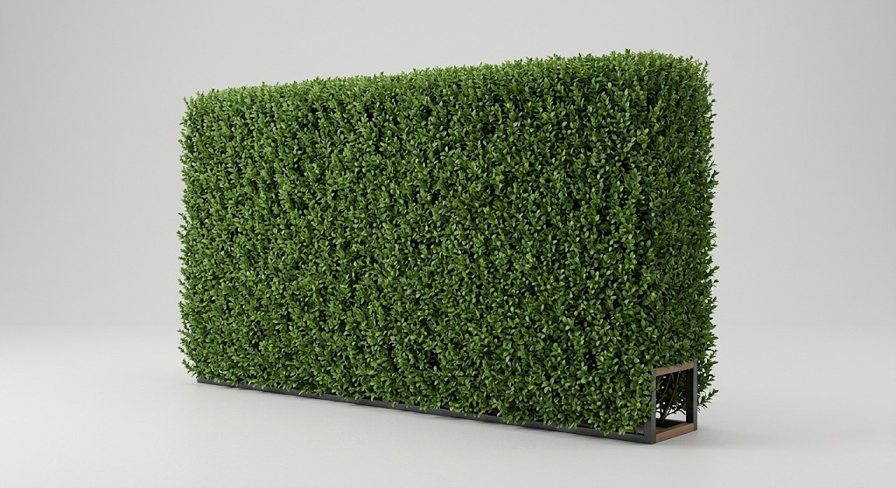

**Banc de bois** — Lattes, accoudoirs, dossier, 140 cm, sans coussin.

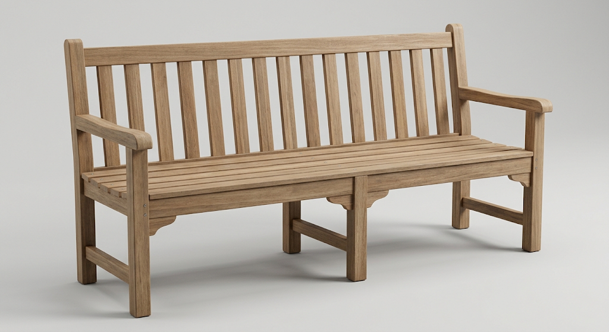

**Arrosoir** — Métal galvanisé, anse, pomme.

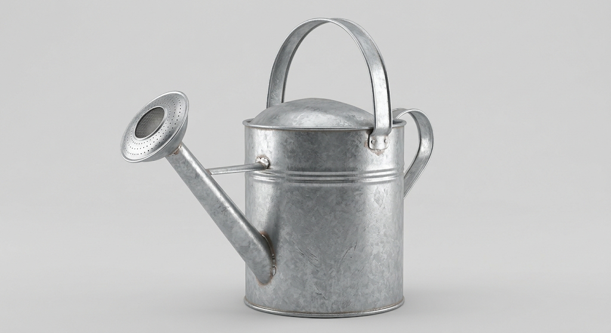

**Dalle terre cuite** — 30 × 30 cm, face usée, 438 triangles. Meshy l’a livrée de chant. Le nettoyage la couche d’un quart de tour, face usée vers le haut. L’épaisseur tombe à 3,9 cm.

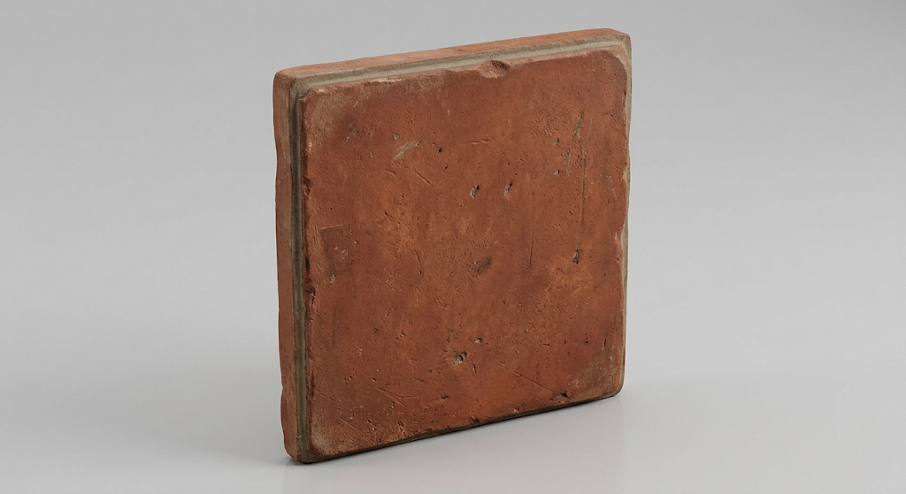

### Maîtres Meshy

Sept meshes sont dans `docs/raw_assets/jardin/`. Même contrat que l’atelier : GLB locaux, hors git, couleur, métal/rugosité et normale en JPEG. Meshy a normé le grand côté à 1. Le facteur métallique vaut 1. La pergola n’a pas de fichier : elle est procédurale.

| Fichier | Prop | Échelle | Source Meshy |
| --- | --- | --- | --- |
| `table.glb` | Pierre, pieds sculptés | Longueur 1,50 m | `1006182835` |
| `coupe.glb` | Terre cuite, vide. Normales lissées sous 60° | Diamètre 18 cm | `1006182812` |
| `dalle.glb` | Terre cuite usée, couchée au nettoyage. 438 triangles | 30 cm de côté, 3,9 cm d’épaisseur | `1009043945` |
| `haie.glb` | Buis, bac compris | Largeur 2 m. La hauteur tombe vers 1,16 m | `1006182843` |
| `banc.glb` | Lattes, dossier | Longueur 1,40 m | `1006182805` |
| `arrosoir.glb` | Zinc, anse, pomme | 40 cm de la pomme à l’anse | `1006182758` |
| `glycine.glb` | Un brin, opaque | 80 cm de chute | `1006182825` |

## Props nettoyés

`pnpm clean:set-props` lit les maîtres et écrit `docs/raw_assets/<ambiance>/baked/<taille>/<prop>.glb`. Les tailles sont 256, 512, 1024 et 2048 ; le client en choisit une par prop via la densité de scène. Les maîtres et le dossier `baked/` restent hors git. `pnpm ship:set-props` copie dans `public/sets/` les seuls paliers demandés de Fluide à Qualité ; ce dossier est versionné pour les builds.

L’échelle est celle des tableaux ci-dessus. Le facteur métallique reste 1 : la texture commande. Pas de Draco : le plus lourd de l’atelier, du salon et du club a moins de 6 000 sommets, et ceux du jardin restent sous 14 000. Le poids est dans les JPEG.

Triangles des copies posées, pièces comprises. Le cyclorama, la table de verre, le rail, la pergola et le plateau de jeu n’y sont pas : ils sont procéduraux. Les 32 pièces font 137 936 triangles dans chaque ligne.

| Scène | Décors | Avec les pièces |
| --- | ---: | ---: |
| Atelier | 24 633 | 162 569 |
| Salon | 111 288 | 249 224 |
| Club | 72 522 | 210 458 |
| Jardin | 197 174 | 335 110 |
| Terrasse | 95 807 | 233 743 |

Le salon pose 324 dalles de 230 triangles, soit 74 520. Le club en pose 196 de 208, soit 40 768. Le jardin pose 352 dalles de 438, soit 154 176. La terrasse en pose 130 de 440, soit 57 200.

L’émission est dans le GLB pour le softbox, le projecteur, l’ampoule de la lampe, le rail, le tube et l’enseigne. Le tube est blanc : le cyan et le magenta sont une teinte par instance. La cheminée n’a pas de carte de feu. Sa lueur est une lumière de scène.

La revue se fait dans le client, avec le moteur du jeu : `pnpm review`. La barre propose Atelier, Salon, Club, Jardin et Terrasse, la caméra de partie, un cadre plus large, et Arrivée, qui rejoue le travelling de la scène affichée. L’image est celle du moteur. Le jardin y pose la table au centre, les deux coupes, le banc deux mètres plus loin, face à la caméra, et l’arrosoir à gauche du banc vu de la caméra de jeu. Le sol de tomettes va jusqu’au banc. Pas de haie. Les glycines pendent des poutres. La pergola est en cubes, 4 × 3 × 2,6 m. La lumière est un soir d’été, plus claire : le soleil reste bas et chaud à droite, son disque dans le ciel est plus petit, et un remplissage blanc-chaud fait ressortir la pierre de la table. Pas de plan à l’horizon. L’atelier, le salon et le club gardent le ciel de midi. Les spots du jardin ne projettent pas. La terrasse y pose la table, deux coupes à gauche du plateau, une lanterne allumée à droite, et une omni bleue basse sur le sol, une balustrade plus étroite (deux travées au fond) et reculée en U, et le banc dans le coin droit au fond. La lumière ambiante est plus haute. Pas de cyprès et pas de plan d’horizon. Les dalles couvrent le sol jusqu’au-delà des barrières. Le plan mouillé reste le joint, dessous. Le ciel est un clair de lune, sans étoiles. La pièce choisie ici est celle de la partie.

## Intégration

Le choix est dans Options, section « Choix de l’ambiance », au-dessus des préréglages. Cinq boutons : Atelier, Salon, Club, Jardin, Terrasse. Atelier est sélectionné. Il reste le défaut de toutes les parties. Le changement s’applique tout de suite, comme la résolution.

La maquette et le client proposent les cinq pièces. Au démarrage, la pièce enregistrée est déjà posée. Sans préférence, c’est l’Atelier. La partie ne charge pas d’HDRI.

La préférence est `atelier`, `salon`, `club`, `jardin` ou `terrasse`, clé `w3dts-chess-ambiance`. Elle est à part du volume d’ambiance et des préréglages graphiques. Une valeur inconnue retombe sur Atelier. Changer Fluide ou Qualité ne change pas la pièce.

La scène jouable et cette revue posent le même décor : mêmes props, même sol, mêmes lumières, même hauteur de plateau. Qualité et Natif reprennent la pile de la revue : occlusion, reflets, bloom, anticrénelage, volume, profondeur de champ. Une partie sans préréglage choisi, ou enregistrée avant cette pile, s’ouvre sur Qualité. Fluide et Équilibré restent plus légers. Chaque pièce a sa miniature dans Options. Le plateau fait 24 mm sous la surface de jeu : il est levé de cette épaisseur, plus 1 mm, pour reposer sur la table. Le Salon ajoute les 2 cm de la nappe. Entre revue et match, la caméra de partie blanche reste la même ; le côté noir miroite Z ([CHESS-B26](sprints/CHESS-B26.md)). Les props servis sont les GLB nettoyés, au palier que la densité de scène choisit (256 à 2048), depuis `public/sets/<scène>/<taille>/`. Le cyclorama d’atelier et la table de verre du club restent procéduraux : leurs GLB Meshy ne sont pas chargés. Le rail cyan sous la table du club n’est pas posé. Les lumières sont celles du moteur. Le softbox de l’Atelier est un spot visé comme le panneau : le moteur n’éclaire pas une surface rectangulaire. Le soleil de pièce est trop faible pour porter une ombre, alors la key projette à sa place : le spot de l’Atelier, la lampe du Salon, le plafonnier du Club. Le détail est dans [Ombres](ombres.md). Aucune HDRI n’est chargée. Si un GLB manque, le plan de toile actuel reste et la partie démarre. Le choix affiché reste celui demandé.

Le découpage est [CHESS-B16](sprints/CHESS-B16.md).

## Vie de revue

La partie reprend les mêmes émetteurs que la revue, aux mêmes places, y compris en Fluide. Le salon, l’atelier et le club ont le feu, la poussière et le cigare. Le plateau, les pièces et la caméra ne bougent pas. Options ne gagne pas de bouton pour les couper.

Le paquet est [`@naanouff/w3dts-particles@0.1.5`](https://www.npmjs.com/package/@naanouff/w3dts-particles), sur npmjs. Il dépend du core `0.0.37` et du logger `0.0.22`, déjà ceux du client. L’API est celle de la démo EmberFountain : `ParticleEmitterComponent`, `initializeParticleEmitters`, `createParticleSystem`. Les graphes viennent du catalogue du viewer (`fire-realistic`, `smoke-realistic`), avec `ParticleInstanceColorGraph` et les cartes `soft_ember` et `soft_smoke`. On ne rallonge pas `ember_particles.compute.wgsl` : le paquet compile le sien. La démo en lance 50 000. Ici chaque émetteur reste sous 400, sans ombre et sans collision.

Trois lieux, hors du damier :

- Salon, sur les bûches. La point `0xff6a32` (intensité 4, portée 2,2 m) vacille : le multiplicateur reste entre 0,75 et 1,25, n’est pas constant, ne tombe pas à 0, et ne recalcule pas l’exposition. Un émetteur `fire-realistic` et un `smoke-realistic` court naissent dans l’âtre, derrière le manteau, pour que la pierre les cache. Pas de texture de feu sur `cheminee.glb`. Le feu reste une lumière.
- Atelier, dans le cône du projecteur et celui de la softbox. Le graphe de fumée monte dans l’axe local de l’émetteur : on l’oriente le long du faisceau. Les grains ne traversent pas les cases.
- Club, sur le bar (`x` 0,35, `z` 3,05). Le bâtonnet est une boîte. Le bout est un petit émetteur braise qui avance le long du bâton puis reboucle. La fumée collée au bout est une volute lente, plus fine que la colonne de l’âtre. Les néons ne clignotent pas.

Jardin et terrasse ne reçoivent rien. La lanterne émet déjà, le soleil du jardin aussi.

La barre de revue a un interrupteur Vie, à côté de Volume, allumé au départ. Éteint, la liste d’émetteurs de la revue est vide. Une partie les garde.

C’est dans la revue et dans la partie. Le découpage est [CHESS-B22](sprints/CHESS-B22.md).

## Hors de ce document

Les cinq pièces sont dans la scène jouable. La terrasse a ses maîtres, sauf le cyprès. Le jardin a ses maîtres, la pergola est procédurale. Arrivée, dans la revue, rejoue le travelling de la scène affichée. Un clic ou un orbite l’arrête sur la caméra de partie.
