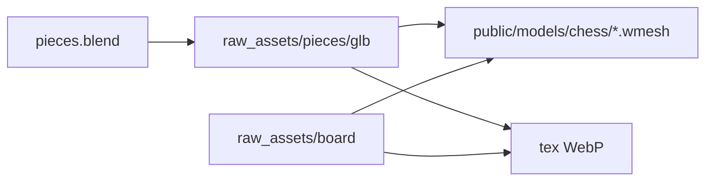

# Assets 3D Staunton

Les pièces jouées viennent de maîtres locaux. Le client charge le `.wmesh` et les WebP copiés dans le dépôt. Les GLB et le fichier Blender restent la source, à pleine définition, hors git.

Sprint d’implémentation : [CHESS-B9](sprints/CHESS-B9.md). Le dossier des binaires est [docs/raw_assets](raw_assets/README.md).

[scripts/import-hd-pieces.mjs](../scripts/import-hd-pieces.mjs) lit `docs/raw_assets/pieces/glb`, décode le Draco et écrit un `.wmesh` à 0,078 m (les exports font 0,12 m). Les noirs sont tournés de 180° : les blancs regardent +Z, les noirs −Z. [scripts/bake-piece-textures.mjs](../scripts/bake-piece-textures.mjs) en extrait les cartes. [src/renderer/host/hdChessPieces.ts](../src/renderer/host/hdChessPieces.ts) sert le `.wmesh` et le WebP du palier graphique ; le GLB n’est lu que si le WebP manque.



## Ce qui reste à pleine qualité

Douze GLB, 20 à 28 Mo chacun. La géométrie pèse peu : environ 30 000 triangles et 1,5 Mo de `.wmesh` par pièce, 367 000 triangles pour le jeu. Le reste est une carte unique par pièce, sans fichier partagé d’une pièce à l’autre :

- normale 4096, PNG, environ 12 à 16 Mo
- couleur 4096, JPEG, environ 8 à 11 Mo
- ORM 2048, JPEG, environ 1,1 à 1,6 Mo

Le rendu Qualité et Natif affiche déjà le WebP 1024 des pièces. Couleur et ORM sont lossy (qualité 82 et 80). Les normales restent en WebP lossless, redimensionnées en linéaire. Les paliers 256 et 512 servent Fluide et Équilibré. Ces réglages, et ceux de [chessGraphicsSettings.ts](../src/renderer/graphics/chessGraphicsSettings.ts), ne bougent pas.

On ne décime pas les maillages : le cavalier et les profils tournés se lisent dans la silhouette. On ne réencode pas les maîtres 4K.

`pieces.blend` (~575 Mo) est le fichier Blender. `pieces.blend1` est une sauvegarde du même ordre de taille : elle ne entre pas dans `docs/raw_assets`.

## Plateau

`chess_board_B.glb` est le premier maître ajouté après les pièces. Même contrat : lien dur, `.wmesh`, WebP, pas de GLB dans `public/`. Les cartes partent plus haut : 512, 1024 et 2048, soit Fluide, Équilibré, puis Qualité et Natif. L’encodeur est celui des pièces.

Le fichier est en Z-up, un mètre de côté. [scripts/import-hd-board.mjs](../scripts/import-hd-board.mjs) le pose à plat, à l’encombrement visuel du plateau (`CHESS_BOARD_MESH_EXTENT`), face supérieure en y = 0. Le client dessine encore le plateau procédural : ce maillage n’est pas encore celui de la scène.

## Dossier des maîtres

```
docs/raw_assets/
  README.md
  pieces/
    pieces.blend
    glb/
      b_pion.glb  b_tour.glb  b_cavalier.glb  b_fou.glb  b_reine.glb  b_roi.glb
      n_pion.glb  n_tour.glb  n_cavalier.glb  n_fou.glb  n_reine.glb  n_roi.glb
  board/
    chess_board_B.glb
```

`b_` est le camp blanc, `n_` le camp noir. Les noms de fichiers restent ceux des exports.

Les maîtres ne vont pas dans git : le dépôt n’a pas de LFS. Seuls les textes de `docs/raw_assets` sont versionnés. Sur disque, chaque maître est un lien dur NTFS vers son fichier d’origine, sur le même volume. Une seule copie réelle.

Les pièces pointent vers `c:/Local/Travail/Print/Models/Echecs`. Le plateau pointe vers le GLB d’apport, aujourd’hui `Downloads/chess_board_B.glb`.

## Runtime

`public/models/chess/` ne garde que les `.wmesh` et `tex/{256,512,1024,2048}/{nom}-{color|normal|orm}.webp`. Ces fichiers runtime sont dans git, pour que l’installateur construit par la CI puisse les servir. L’import n’y dépose plus le GLB, et les `.glb` restent ignorés. Les pixels des pièces ne changent pas tant que le bake relit les mêmes GLB.

Le repli qui fetch `/models/chess/{fichier}.glb` dans `hdChessPieces.ts` reste. Sans WebP, ce fetch échoue. Pas d’autre chemin de chargement.

Les HDRI 2K de `public/hdri/` restent à leur place (`studio_kontrast_04_2k.hdr`, `neon_photostudio_2k.hdr`). `monochrome_studio_04_2k.hdr` est cité dans le code et absent du disque : on ne le fabrique pas.

## Pipeline

```bash
node scripts/import-hd-pieces.mjs
node scripts/import-hd-board.mjs
pnpm bake:piece-textures
```

La preuve que l’échelle, le yaw des noirs et les cartes des pièces n’ont pas bougé est un hash identique des `.wmesh` et des WebP de pièces, avant et après ces commandes.
