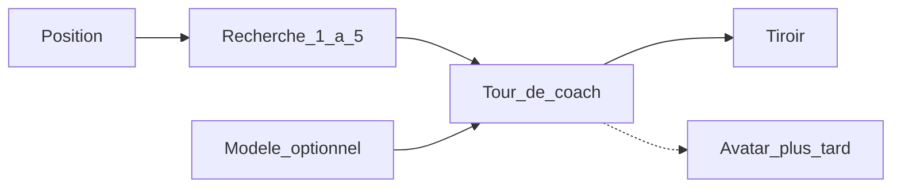

# Coach IA (Ollama ou distant)

Le coach commente la position. Il ne joue pas.

[`IChessEngine`](../src/chess/rules/IChessEngine.ts) et [`HeuristicChessEngine`](../src/chess/rules/HeuristicChessEngine.ts) restent l’adversaire CPU. Un petit modèle invente des coups s’il calcule seul. La recherche produit la ligne. Le modèle la commente, à partir d’une photo fournie par [`ChessMatch`](../src/chess/rules/ChessMatch.ts) : FEN, trait, échec, mat, pat, matériel, au plus 48 SAN légaux, historique. En quiz d’ouverture, le coup du livre n’est pas étiqueté.

Le sprint est [CHESS-B15](sprints/CHESS-B15.md). [CHESS-B7](sprints/CHESS-B7.md) décrit le même moteur, avec un panneau qui ne se fait pas.

## État

La maquette [docs/mockup/index.html](mockup/index.html) a déjà le tiroir : Expliquer, Indice, question libre, bandeau « commentaire, pas un coup ». Paramètres y propose Ollama ou une API distante. Les réponses sont des phrases fixes.

La coque reprend ce tiroir dans [`ChessShell.tsx`](../src/renderer/shell/ChessShell.tsx). Les boutons disent qu’aucun modèle n’est branché. Le preload n’expose pas `coachSettings` ni `coachChat`. Aucun module `src/chess/coach/` n’existe. `coachBusy` dans le HUD veut dire « le livre joue la réplique ».

## Tour de coach

Un seul objet nourrit l’affichage :

- le texte du commentaire
- la ligne SAN, vide hors entraînement
- un drapeau « en train de parler »

Le tiroir est le premier présentateur. Un avatar futur en est un second, branché sur le même objet. Il lit le commentaire. Il ne choisit pas de coup.



## Maquette

L’écran se valide dans `docs/mockup` avant le client. [docs/maquette-ui.md](maquette-ui.md) suit la page, dans le même ticket.

Le tiroir gagne un cadre de présence en tête. Il contient le blason, au repos. Le même cadre recevra un buste. Le texte reste dessous.

Deux états, selon le mode de la barre :

- Partie ordinaire : Expliquer, Indice, question libre.
- Entraînement : Stop ou Reprendre, Annuler mon coup, les 10 minutes coupées par défaut, curseur de 1 à 5, Expliquer mon erreur, Stratégie. Un texte d’accueil dit ce qui va se passer. La ligne n’est pas écrite en cases. Elle est posée sur le plateau, seulement pour les coups de l’élève : un fantôme coloré, vert puis bleu puis jaune, ensuite orange et violet. Le liseré de la même couleur entoure sa pièce qui part. Le rouge entoure seulement le coup faible. Sans modèle, les fantômes restent et le texte renvoie vers Paramètres.

Les clics de la maquette restent locaux. Échap ferme le tiroir avant d’ouvrir la pause.

## Entraînement

L’objection juge le coup avec la même profondeur que les fantômes. Jouer le coup vert, celui affiché, ne la déclenche pas. Les fantômes d’après sont recalculés après la réplique adverse.

Quand l’assistant coupe la partie de lui-même, ce n’est pas un tiroir qui s’ouvre en silence. Le blason bondit, le plateau tremble, et le mot « Objection ! » claque au centre. Le tiroir dit tout de suite pourquoi la partie s’arrête, que le liseré rouge est le coup faible, que le fantôme vert est le coup recommandé, et qu’on peut annuler pour réessayer. Ensuite le modèle parle dans la langue de l’interface, en deux phrases courtes. En français, le ton est simple et pédagogique, dans un registre presque soutenu : le vouvoiement, des phrases correctes, sans familiarité. Les phrases fixes de l’accueil et de l’objection ont le même ton. La réponse s’affiche dans une bulle collée à droite, juste à gauche du tiroir. Une page ne coupe pas une phrase. Précédent et Suivant n’apparaissent que s’il y a une page de ce côté. À la dernière page, Passer devient Fermer. L’étudiant peut aussi stopper la partie sans ce cri. Dans les deux cas la réplique en cours est annulée, et rien ne part tant qu’il n’a pas repris.

Les 10 minutes sont coupées. Le bouton « Remettre les 10 minutes » les rallume. « Couper les 10 minutes » les fige de nouveau. Tant qu’elles sont coupées, la pendule n’apparaît pas et ne tombe pas à zéro.

Annuler mon coup retire son dernier coup, et la réplique du CPU si elle a déjà été jouée. La partie reste en pause.

Expliquer mon erreur compare ce coup à une ligne de 1 à 5 demi-coups cherchée depuis la position d’avant. Stratégie cherche la même profondeur depuis la position actuelle. Le modèle reçoit les SAN. L’étudiant voit des fantômes colorés sur les cases d’arrivée, pas les noms de cases. Le vert est le prochain coup de l’élève. Les coups de l’adversaire ne sont pas posés sur le plateau. Le liseré de la même couleur est le contour complet de la pièce encore sur sa case : une passe de masque, puis une passe de contour. Le masque est fondu, pas opaque : un mesh opaque est groupé avec les pièces et cette passe ne le dessine pas. Il a sa propre profondeur, vidée à chaque image, sinon la pièce le cache. Il a aussi une cible de normales, sinon le shader de pièce, qui en écrit une, ne dessine pas. Il est épinglé au moment où la ligne est tracée. Une pièce qui part, ou qui arrive ensuite sur une case de la ligne, ne le garde pas. Ces passes tournent sur tous les profils, y compris Fluide et un Fluide déjà enregistré qui les omettait. Sans modèle, les fantômes restent.

La recherche est bornée en nœuds. Ce n’est pas Stockfish.

## Transport

Un seul client, le format chat d’OpenAI (`POST {baseUrl}/chat/completions`). L’adresse locale contient déjà `/v1`.

- Local : `http://127.0.0.1:11434/v1`, sans clé. Au lancement, le client interroge ce port. S’il répond, il enregistre `llama3.2` s’il est là, sinon le premier modèle, et l’écran ne demande rien. S’il est installé mais muet, un bouton le lance. S’il est absent, un bouton ouvre la page de téléchargement. Un autre serveur reste un choix replié.
- Distant : URL, modèle et clé saisis par l’utilisateur.

L’appel part du processus main. Le renderer est sandboxé ([`src/main/index.ts`](../src/main/index.ts)) : un `fetch` vers Ollama y échoue souvent, et la clé ne doit pas rester dans la page.

Le preload expose `coachSettings`, `coachSaveSettings`, `coachProbe`, `coachLaunch`, `coachOpenDownload`, `coachModels`, `coachChat` et `coachCancel`. Réglages dans `userData/coach-settings.json`. Le getter renvoie l’URL, le modèle, le fournisseur et `hasKey`, jamais la clé. `fetch` natif, timeout 60 s, annulation. La forme HTTP vit dans un module sans Electron, couvert par Vitest.

Le présentateur est le tiroir de la coque, pas un second panneau sur le HUD.

## Installation Ollama (Windows)

Pour l’alpha, le coach **sans modèle** reste le cas nominal. Cette section est pour les volontaires qui veulent brancher un modèle local. Sprint : [CHESS-B24](sprints/CHESS-B24.md).

1. Installer Ollama depuis [ollama.com/download](https://ollama.com/download). Redémarrer si l’installateur le demande.
2. Ouvrir un terminal et tirer le modèle par défaut du client :

```bash
ollama pull llama3.2
```

3. Vérifier que le service répond : `ollama list` doit montrer `llama3.2`, ou ouvrir `http://127.0.0.1:11434` dans le navigateur (réponse courte du serveur).
4. Lancer ChessMaster. Ouvrir **Paramètres** → section assistant. Si Ollama tourne, le client le détecte et choisit `llama3.2` (ou le premier modèle disponible). Sinon : bouton pour lancer Ollama, ou lien de téléchargement s’il est absent.
5. En partie ou en entraînement, ouvrir le tiroir **Assistant** → **Expliquer**. Une réponse en une ou deux phrases confirme le branchement. Si rien ne vient : Ollama est arrêté, le modèle manque, ou un pare-feu bloque `127.0.0.1:11434`.

API distante (URL + modèle + clé) reste un choix replié dans Paramètres. La clé ne revient pas à l’écran.

## Hors de ce palier

- Avatar parlant, voix, visème.
- Remplacer le CPU, brancher Stockfish, ou faire jouer le texte du modèle.
- Streaming SSE.
- Fil de plus d’un échange.
