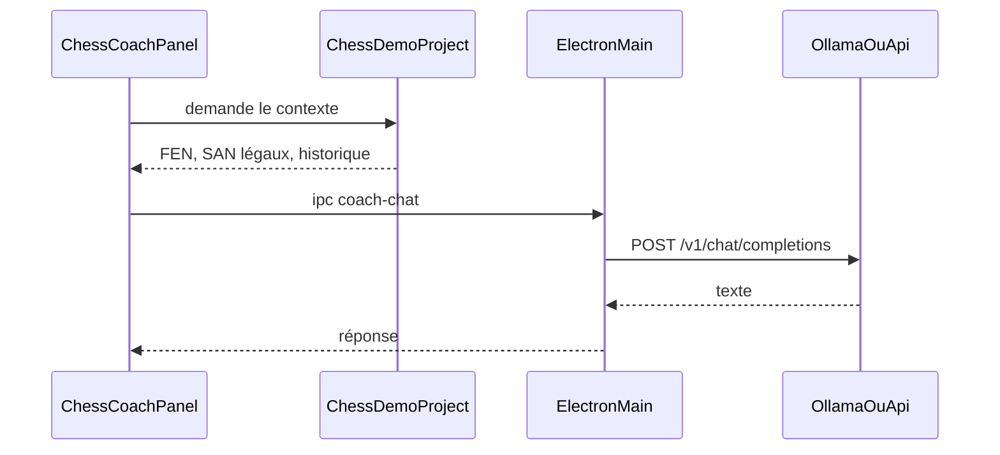

# Coach IA (Ollama ou distant)

Le coach commente la position. Il ne joue pas.

[`IChessEngine`](../src/chess/rules/IChessEngine.ts) et [`HeuristicChessEngine`](../src/chess/rules/HeuristicChessEngine.ts) restent l’adversaire CPU. Le coach explique, donne un indice, ou répond à une question, à partir d’une photo de la position produite par [`ChessMatch`](../src/chess/rules/ChessMatch.ts).

Un petit modèle local invente des coups s’il calcule seul. On lui donne donc le FEN, la liste SAN légale, le matériel, l’échec ou le mat, et l’historique. En quiz d’ouverture, le coup du livre n’est pas étiqueté dans le prompt.

Sprint d’implémentation : [CHESS-B7](sprints/CHESS-B7.md).

## Transport

Un seul client, le format chat d’OpenAI (`POST {baseUrl}/v1/chat/completions`) :

- Local : `http://127.0.0.1:11434/v1`, sans clé (Ollama). Le modèle n’est pas imposé : l’utilisateur le choisit dans la liste renvoyée par `GET {baseUrl}/v1/models`.
- Distant : URL, modèle et clé fournis par l’utilisateur (OpenAI, OpenRouter, vLLM, ou un autre serveur compatible).

L’appel part du processus main, pas du renderer. Le renderer est sandboxé ([`src/main/index.ts`](../src/main/index.ts)) : un `fetch` vers Ollama y échoue souvent à cause du CORS, et la clé d’API ne doit pas rester dans la page.

Le preload ([`src/preload/index.ts`](../src/preload/index.ts)) n’expose que :

- `coachSettings` — URL, modèle, fournisseur, `hasKey`
- `coachSaveSettings` — écriture des réglages, clé comprise
- `coachListModels`
- `coachChat` — un échange, avec annulation

Réglages dans `userData/coach-settings.json`, écrit par le main. Le getter ne renvoie jamais la clé. Pas de nouvelle dépendance : `fetch` natif d’Electron 35. Timeout 60 s, bouton pour annuler (`AbortController`).

La forme HTTP (corps de requête, lecture de la réponse, masquage de la clé) vit dans un module sans Electron, pour que Vitest puisse la couvrir. Le processus main ne fait que le fichier, le `fetch` et l’IPC.

## Contexte

Module `src/chess/coach/coachContext.ts`. Photo sérialisable :

- FEN, trait, échec, mat, pat.
- Bilan matériel, même barème que le moteur heuristique (pion 100, cavalier 320, fou 330, tour 500, dame 900).
- SAN légaux, via `legalMoves()` puis `tryMove` sur une copie. Plafond 48. Un drapeau indique si la liste a été tronquée.
- Historique SAN, tenu par [`ChessDemoProject`](../src/renderer/host/ChessDemoProject.ts).
- Mode learn : code ECO, nom, et `quiz`. Jamais de champ « coup attendu ».

L’historique s’allonge à chaque coup réussi (prise humaine dans `onSelectUp`, coup programmé dans `playProgrammaticMove`). Il est vidé dans `resetChessPlaySession`, `applySession`, `resetMatch` et `rebuildFromFen`. Un resync FEN P2P perd donc les SAN : le coach reste valide à partir du FEN et des coups légaux.

`coachPrompt.ts` assemble un message système court :

- Répondre dans la langue de la question. Anglais si la question est vide, comme le HUD.
- Ne citer un coup que s’il figure dans la liste SAN.
- Ne pas se présenter comme un moteur d’analyse.

En quiz, le prompt d’indice interdit de nommer le coup du livre et la case d’arrivée. Le SAN peut encore apparaître dans la liste des coups légaux : le test vérifie l’absence d’une ligne « coup du livre », pas l’absence du SAN dans toute la liste.

Le projet publie cette photo sur l’événement de bus `w3dts-chess-coach-context` quand la position change. Pas à chaque seconde d’horloge.

## Interface

Panneau verre sur le même modèle que [`ChessGraphicsMenu`](../src/renderer/ui/ChessGraphicsMenu.tsx), monté dans [`ChessGameplayHud`](../src/renderer/ui/ChessGameplayHud.tsx).

Trois actions : Expliquer, Indice, question libre. L’état « en cours » vit dans le panneau. Ne pas réutiliser `coachBusy` : ce drapeau veut déjà dire « le livre joue la réplique ».

Bandeau fixe : le texte est un commentaire, pas une évaluation moteur.

## Hors scope

- Remplacer le CPU, brancher Stockfish, ou faire jouer le texte du modèle.
- Streaming SSE. Réponse complète d’abord. Le flux viendra seulement si l’attente locale est trop longue.
- Historique de conversation long. Un échange à la fois, plus le contexte de la position.
