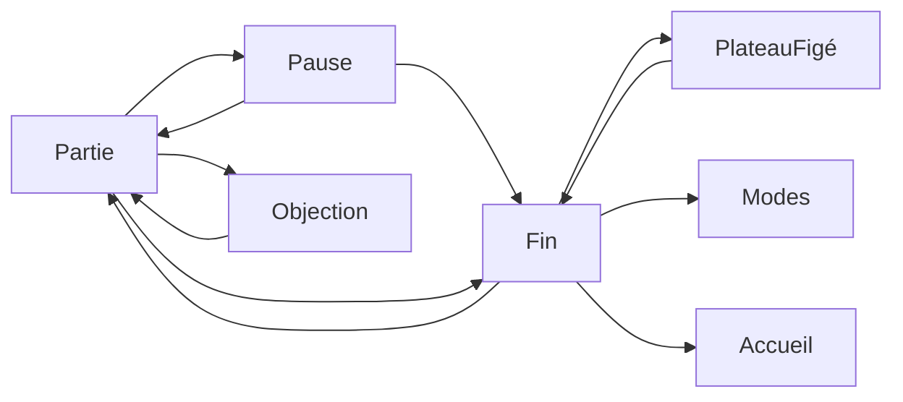

# Objection et fin de partie

La page cliquable [docs/mockup](mockup/index.html) reprend ce contrat. La carte de fin et l’objection sont dans le client.

Sprints : [CHESS-B18](sprints/CHESS-B18.md) (maquette), [CHESS-B24](sprints/CHESS-B24.md) (abandon, nulle, Objection en prod).

Le cri et la fin de partie ne se ressemblent pas. L’objection est un cri, sans bouton. La fin est une carte en verre, comme la pause : le plateau reste visible autour.

## Objection

En entraînement, quand l’assistant coupe de lui-même, le blason claque et « Objection ! » s’abat, le studio tremble, puis le tiroir explique. « Jouer le coup » vert, celui recommandé, ne déclenche pas le cri.

Le cri reste le nôtre : blason, dalle ambre, pas de personnage emprunté. Il dure assez pour être lu, puis il s’en va vers le tiroir.

- Le studio tremble, le blason tombe et tamponne, « Objection ! » claque en biais sur la dalle ambre.
- Une seconde ligne apparaît dessous : « Ce n’est pas le coup le plus net. »
- Le tout tient environ 1,6 s, puis le mot se réduit vers le cadre rond du tiroir. Le focus reste sur Stop.
- Pas de bouton sur le cri. Le pointeur traverse l’overlay.
- Mouvement réduit : pas de claque ni de tremblement. La phrase est seulement dans le tiroir.

## Fin de partie

Une seule carte, trois titres.

- **Gagné** — « Les noirs sont échec et mat. »
- **Perdu** — « Les blancs sont échec et mat. » Le drapeau tient dans la même carte : « Les blancs ont perdu au temps. » L’abandon aussi : « Les blancs ont abandonné. »
- **Nulle** — « Pat. Aucun coup légal. » Matériel insuffisant : « Matériel insuffisant. » Nulle acceptée : « Nulle acceptée. »

Pas de sauvegarde. Une partie finie ne s’enregistre pas, comme le dit [persistance.md](persistance.md).

Boutons : Voir le plateau, Recommencer, Changer de mode, Retour à l’accueil. Voir le plateau referme la carte et laisse le résultat dans la barre, avec un bouton Résultat pour la rouvrir. Recommencer relance le même mode. Échap ne reprend pas une partie finie : il ramène à l’accueil.

Dans la maquette, des liens à côté de l’étiquette « Maquette » ouvrent ces états. Ils ne font pas partie de l’écran de production.

## Abandon et nulle proposée

Depuis Pause : Abandon et Proposer nulle.

- **Abandon** — le camp local (ou le camp au trait en hotseat) perd. Carte Perdu, ligne d’abandon.
- **Proposer nulle** —
  - Contre l’ordinateur : le CPU accepte si l’évaluation heuristique à la profondeur courante est dans ±50 centipions, sans échec subi et sans mat forcé en un coup ; sinon il refuse et la partie continue.
  - À deux sur le même écran : l’autre camp voit Accepter ou Refuser.
  - Sur cet ordinateur et en ligne : le fil porte l’offre et la réponse (`p2p`).
  - Acceptée : carte Nulle. Refusée : retour à la partie, pendules inchangées.

Pas de règle des 50 coups ni de triple répétition.

## Hors de ce contrat

Pas de compte, pas de Stockfish. Pas de règle des 50 coups ni de triple répétition. Recommencer relance la même partie.
