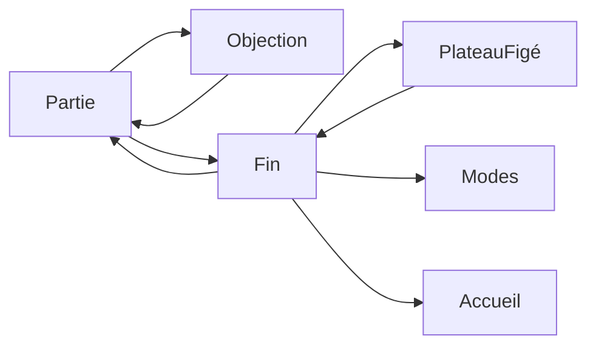

# Objection et fin de partie

La page cliquable [docs/mockup](mockup/index.html) reprend ce contrat. Le client ne le reçoit qu’après validation de la maquette.

Sprint : [CHESS-B18](sprints/CHESS-B18.md).

Le cri et la fin de partie ne se ressemblent pas. L’objection est un cri, sans bouton. La fin est une carte en verre, comme la pause : le plateau reste visible autour.

## Objection

Aujourd’hui, « Jouer le coup » en entraînement fait claquer le blason et « Objection ! » pendant 0,9 s, secoue le studio, puis coupe net. Le tiroir est déjà ouvert derrière.

Le cri reste le nôtre : blason, dalle ambre, pas de personnage emprunté. Il dure assez pour être lu, puis il s’en va vers le tiroir.

- Le studio tremble, le blason tombe et tamponne, « Objection ! » claque en biais sur la dalle ambre.
- Une seconde ligne apparaît dessous : « Ce n’est pas le coup le plus net. »
- Le tout tient environ 1,6 s, puis le mot se réduit vers le cadre rond du tiroir. Le focus reste sur Stop.
- Pas de bouton sur le cri. Le pointeur traverse l’overlay.
- Mouvement réduit : pas de claque ni de tremblement. La phrase est seulement dans le tiroir.

## Fin de partie

Une seule carte, trois titres d’exemple.

- **Gagné** — « Les noirs sont échec et mat. »
- **Perdu** — « Les blancs sont échec et mat. » Le drapeau tient dans la même carte : « Les blancs ont perdu au temps. »
- **Nulle** — « Pat. Aucun coup légal. »

Pas de sauvegarde. Une partie finie ne s’enregistre pas, comme le dit [persistance.md](persistance.md).

Boutons : Voir le plateau, Recommencer, Changer de mode, Retour à l’accueil. Voir le plateau referme la carte et laisse le résultat dans la barre, avec un bouton Résultat pour la rouvrir. Recommencer relance le même mode. Échap ne reprend pas une partie finie : il ramène à l’accueil.

Dans la maquette, trois liens à côté de l’étiquette « Maquette » ouvrent ces trois états. Ils ne font pas partie de l’écran de production.

## Hors de ce contrat

Pas d’abandon proposé, pas de compte, pas de Stockfish. Le client, le grab et les règles ne changent pas dans le sprint qui réalise cette page.
