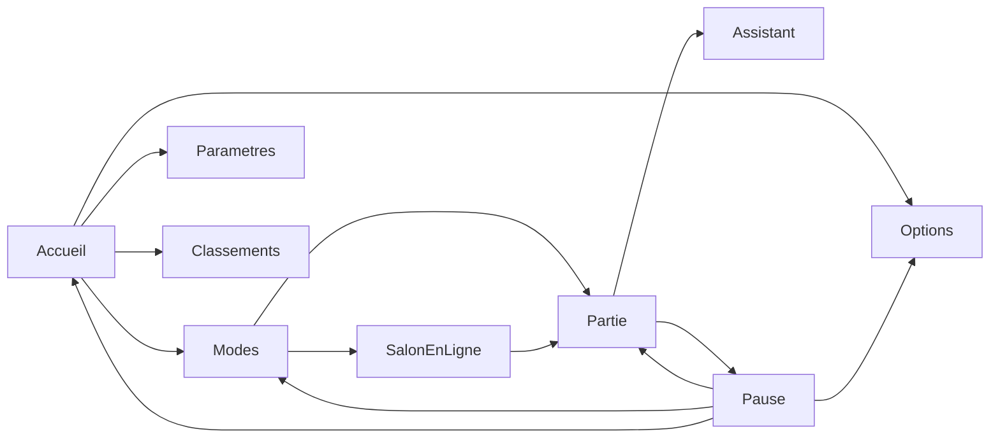

# Maquette UI du shell ChessMaster

Le plateau 3D reste le décor. Les menus sont des cartes en verre par-dessus, pas un site à part. L’assistant et le salon en ligne font partie du parcours, au même titre que les modes déjà jouables.

La maquette cliquable vit dans [docs/mockup](mockup/index.html). Le sprint qui la produit est [CHESS-B8](sprints/CHESS-B8.md). Elle ne remplace pas le HUD du client.

Langue de l’interface : français. L’ambre `#e8b86d` et le verre de [`src/renderer/chess-hud.css`](../src/renderer/chess-hud.css) restent les seuls accents. Le blason [`public/brand/w3dts-chessmaster-logo.png`](../public/brand/w3dts-chessmaster-logo.png) est la marque, en grand à l’accueil et en petit en partie.

## Parcours

Échap ouvre la pause depuis la partie, et ferme le panneau courant ailleurs. La saisie d’une pièce est coupée tant qu’un menu plein est ouvert, comme le fait déjà le sélecteur de mode.

## Écrans

**Accueil.** Blason centré, une ligne « W3DTS ChessMaster », bouton principal Jouer, puis trois liens : Classements, Options, Paramètres. Le studio reste visible autour de la carte. Les pièces sont au repos.

**Modes.** Cinq cartes. Les quatre premières existent dans [`ChessModePicker.tsx`](../src/renderer/ui/ChessModePicker.tsx). La cinquième est le salon en ligne, distinct du P2P local.

- Contre l’ordinateur — couleur (blancs / noirs) et un curseur de niveau affiché. Le moteur reste l’heuristique actuelle.
- À deux, même écran — hot-seat.
- Sur cet ordinateur — la seconde fenêtre déjà ouverte par `openPeerWindow` et `BroadcastChannelTransport`.
- En ligne — ouvre le salon, pas une partie tout de suite.
- Apprendre — liste ECO déjà fournie par `ECO_OPENINGS`.

Le bouton Commencer, hors ligne, correspond au chemin `apply-session` du picker actuel.

**Salon en ligne.** Deux colonnes : Créer une table (code à partager, copie, attente de l’adversaire) et Rejoindre (saisie du code). Bandeau d’état repris des libellés P2P du HUD : en attente, connexion, connecté, déconnecté. La couleur se choisit seulement pour celui qui crée la table ; l’invité prend l’autre. Une fois les deux présents, la partie démarre sur le même plateau. Le transport réel aujourd’hui est le canal local de [`ChessDemoProject.ts`](../src/renderer/host/ChessDemoProject.ts). L’écran montre le parcours (code, attente, abandon, adversaire parti). Le relais qui ferait se rencontrer deux machines n’est pas dans cette maquette.

**Partie.** La barre fine remplace le bloc bas-gauche (statut, pendules, Mode, Options) : blason réduit, trait et pendule, Assistant, Pause. En ligne, la barre ajoute l’état de liaison. Les touches LMB / RMB / X restent en bas, plus petites.

**Assistant.** Tiroir à droite du plateau, ouvert depuis la barre, sans quitter la partie. Trois actions de [coach-ia.md](coach-ia.md) : Expliquer la position, Indice, question libre. Un bandeau rappelle que le texte commente : il ne joue pas et ne remplace pas le moteur. L’attente reste dans le tiroir. Sans modèle, le tiroir renvoie vers Paramètres. En mode Apprendre, le coup du livre n’est pas donné tel quel.

**Pause.** Reprendre, Changer de mode, Options, Retour à l’accueil. En ligne, si la liaison est encore ouverte, Reprendre est accompagné de Quitter la table. Retour à l’accueil masque la partie, il ne détruit pas le plateau.

**Options.** Uniquement le rendu, repris de [`chessGraphicsSettings.ts`](../src/renderer/graphics/chessGraphicsSettings.ts) : préréglages Fluide / Équilibré / Qualité / Natif, résolution, textures 256 / 512 / 1024, ombres, occlusion, reflets, bloom, ligne « Rendu W×H · img/s ». Le réglage s’applique tout de suite.

**Paramètres.** Volume des coups et de l’ambiance, langue de l’interface, rappel des contrôles, et le branchement de l’assistant. Deux choix, ceux de [CHESS-B7](sprints/CHESS-B7.md) : Ollama local (`http://127.0.0.1:11434/v1`, sans clé) ou API distante (URL, modèle, clé). La clé saisie ne revient pas à l’écran : seulement « clé enregistrée ». La liste des modèles vient de `GET /v1/models`. Ces réglages nourrissent le tiroir ; ils ne vivent pas dans la partie.

**Classements.** Deux onglets. Local : victoires, défaites, nuls, série, cinq dernières parties, marqués « exemple ». En ligne : la même grille filtrée sur les parties du salon, encore en exemple tant qu’il n’y a pas de serveur de scores. Pas de formulaire de compte.

## Hors maquette

- Pas de compte joueur, pas de serveur de matchmaking, pas de Stockfish.
- L’assistant suit le contrat de B7. Sans les canaux IPC, le tiroir et Paramètres restent cliquables avec des réponses d’exemple.
- Pas de refonte du rendu 3D, du grab, ni des règles.
- Une fois le shell branché dans le client, le sélecteur Mode et le dialogue Graphismes quittent la barre de partie pour ne pas avoir deux entrées.
