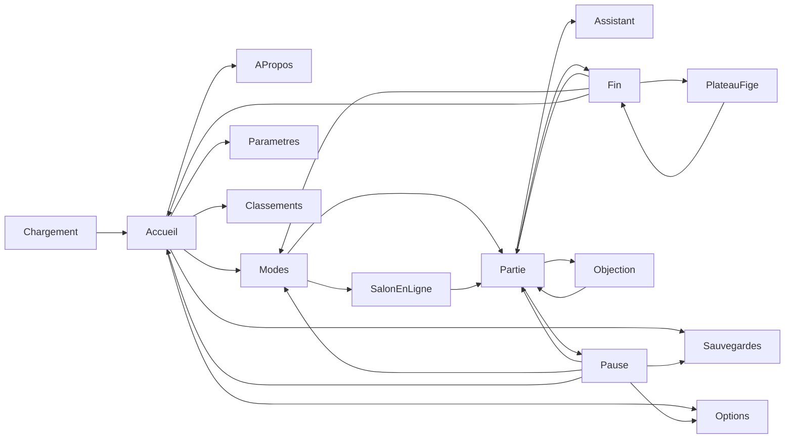

# Maquette UI du shell ChessMaster

Le plateau 3D reste le décor. Les menus sont des cartes en verre par-dessus, pas un site à part. L’assistant et le salon en ligne font partie du parcours, au même titre que les modes déjà jouables.

La maquette cliquable vit dans [docs/mockup](mockup/index.html). Le sprint qui la produit est [CHESS-B8](sprints/CHESS-B8.md). Le branchement dans le client est décrit dans [docs/shell-client.md](shell-client.md) et découpé dans [CHESS-B10](sprints/CHESS-B10.md). L’objection, la carte de fin, l’abandon et la nulle proposée sont dans la page, selon [fin-partie.md](fin-partie.md), [CHESS-B18](sprints/CHESS-B18.md) et [CHESS-B24](sprints/CHESS-B24.md).

Un écran nouveau ou modifié se valide d’abord dans cette maquette. Le client ne le reçoit qu’après cette validation.

Langue de l’interface : français. Le blason [`public/brand/w3dts-chessmaster-logo.png`](../public/brand/w3dts-chessmaster-logo.png) est la marque, en grand à l’accueil et en petit en partie.

Le thème est un verre liquide : le fond se voit à travers un voile très clair (`--glass`, `--blur` court), et un bourrelet épais suit l’arrondi (`--rim`), plus lumineux en haut à gauche, avec un sillon intérieur. Les contrôles (bouton, segment, champ, interrupteur, curseur) ne portent pas de couleur en dur. Ils lisent les jetons de [`docs/mockup/mockup.css`](mockup/mockup.css) : `--accent`, `--glass`, `--blur`, `--radius`, `--control-well`. Changer ces jetons recolore toute la maquette. Options et Paramètres sont des feuilles à sections (choix de l’ambiance, préréglage, image, effets ; son, langue, contrôles, assistant). Une feuille plus haute que l’écran garde son titre et Fermer. Seul le corps défile : un mince curseur dans le verre, et le bas du texte s’efface dans le panneau.

## Parcours

Échap ouvre la pause depuis la partie, et ferme le panneau courant ailleurs. Depuis une partie finie, Échap ramène à l’accueil et ne reprend pas la partie. La saisie d’une pièce est coupée tant qu’un menu plein est ouvert, comme le fait déjà le sélecteur de mode.

## Écrans

**Chargement.** Au lancement, fond blanc : le studio n’est pas visible. Seul le blason, grand et centré. Il est en niveaux de gris, puis la couleur remonte du bas vers le haut pendant le chargement. Quand il est coloré, le blanc disparaît en fondu et l’accueil apparaît sur le studio. Pas de carte, pas de bouton. En bas à droite, une ligne discrète : « ChessMaster & W3DTS copyright Cyril TARRIET ». Échap ne fait rien pendant ce temps.

**Accueil.** Blason centré, une ligne « W3DTS ChessMaster », bouton principal Jouer. S’il existe une partie interrompue, un bouton « Reprendre la partie », centré sous Jouer. Puis cinq liens : Sauvegardes, Classements, Options, Paramètres, À propos. La carte est plus large que les autres panneaux, pour que ces liens restent dans le verre. Le studio reste visible autour. Les pièces sont au repos.

**Modes.** Six cartes. Les quatre premières existent dans [`ChessModePicker.tsx`](../src/renderer/ui/ChessModePicker.tsx). La cinquième est le salon en ligne, distinct du P2P local. La sixième est l’entraînement.

- Contre l’ordinateur — couleur (blancs / noirs) et un curseur de niveau 1–3. Le moteur reste l’heuristique actuelle.
- À deux, même écran — hot-seat.
- Sur cet ordinateur — la seconde fenêtre déjà ouverte par `openPeerWindow` et `BroadcastChannelTransport`.
- En ligne — ouvre le salon, pas une partie tout de suite.
- Apprendre — liste ECO déjà fournie par `ECO_OPENINGS`.
- Entraînement — partie contre l’ordinateur, avec la revue du tiroir. La couleur se choisit comme contre l’ordinateur. Pas de curseur de niveau.

Le bouton Commencer, hors ligne, correspond au chemin `apply-session` du picker actuel.

**Salon en ligne.** Deux colonnes : Créer une table (code à partager, copie, attente de l’adversaire) et Rejoindre (saisie du code). Bandeau d’état repris des libellés P2P du HUD : en attente, connexion, connecté, déconnecté. La couleur se choisit seulement pour celui qui crée la table ; l’invité prend l’autre. Une fois les deux présents, la partie démarre sur le même plateau. L’écran montre le parcours (code, attente, abandon, adversaire parti). Le client joint le relais décrit dans [multijoueur.md](multijoueur.md). Cette maquette ne simule pas le relais.

**Partie.** La barre fine remplace le bloc bas-gauche (statut, pendules, Mode, Options) : blason réduit, trait et pendule, Assistant, Pause. En ligne, la barre ajoute l’état de liaison. Les touches LMB / RMB / X restent en bas, plus petites. Quand la partie est finie, la barre garde le résultat et un bouton Résultat à la place de la pendule et de Pause.

**Assistant.** Tiroir à droite du plateau, ouvert depuis la barre, sans quitter la partie. Un cadre rond en tête porte le blason, au repos : c’est la place d’un avatar plus tard. Le texte de la réponse est sous les actions. Un bandeau rappelle que le texte commente : il ne joue pas et ne remplace pas le moteur. L’attente reste dans le tiroir.

En entraînement, « Jouer le coup » fait intervenir l’assistant. Le studio tremble, le blason tombe, et « Objection ! » claque sur la dalle ambre, avec la ligne « Ce n’est pas le coup le plus net. » Le cri tient environ 1,6 s, puis se réduit vers le cadre rond du tiroir. Stop prend le focus. Pas de bouton sur le cri. Avec un mouvement réduit, il n’y a ni claque ni tremblement : la phrase est seulement dans le tiroir. Le tiroir s’ouvre, la partie est arrêtée, les fantômes sont là. Ce n’est pas une copie d’un autre jeu : le cri et le blason sont les nôtres. En partie ordinaire, trois actions de [coach-ia.md](coach-ia.md) : Expliquer, Indice, question libre. En entraînement : Stop ou Reprendre, Annuler mon coup, un curseur de 1 à 5, Expliquer mon erreur, Stratégie. Le plan est sur le plateau, pas dans le tiroir : un pion ou une pièce fantôme par demi-coup, le plus net pour le prochain coup, les autres plus transparents. Sans modèle, ces fantômes restent et le texte renvoie vers Paramètres. En mode Apprendre, le coup du livre n’est pas donné tel quel.

**Pause.** Reprendre, Sauvegarder, Sauvegardes, Abandon, Proposer nulle, Changer de mode, Options, Retour à l’accueil. Sauvegarder confirme en une ligne « Partie sauvegardée ». Abandon et Proposer nulle suivent [fin-partie.md](fin-partie.md). Reprendre ramène à la table : ce n’est pas le chargement d’une fiche. En ligne, si la liaison est encore ouverte, Reprendre est accompagné de Quitter la table. Retour à l’accueil masque la partie, il ne détruit pas le plateau.

**Fin de partie.** Carte en verre au centre, le plateau reste visible, blason au-dessus du titre. Exemples, ouverts par la pastille Fin en bas à gauche : Gagné, Perdu (mat, drapeau, abandon), Nulle (pat, matériel insuffisant, nulle acceptée). Boutons : Voir le plateau, Recommencer, Changer de mode, Retour à l’accueil. Pas de sauvegarde. Voir le plateau referme la carte. Recommencer relance le même mode. Échap ramène à l’accueil. Ces liens ne sont pas dans la barre. Le contrat est dans [fin-partie.md](fin-partie.md).

**Sauvegardes.** Feuille du même verre qu’Options. Bandeau « Partie interrompue » en tête (Contre l’ordinateur, Restaurer, Écarter), puis deux sauvegardes demandées : « Sur cet ordinateur » et « En ligne », chacune avec Restaurer et Supprimer. Écarter et Supprimer retirent la ligne. Quand il ne reste rien, l’écran dit « Aucune partie gardée », sans exemple. Fermer ou Échap revient à l’écran précédent. Le contrat est dans [persistance.md](persistance.md).

**Options.** Choix de l’ambiance au-dessus des préréglages : Atelier, Salon, Club, Jardin, Terrasse, chacun avec une miniature de la scène. Une miniature non choisie est en gris. Elle se colore au survol et se décolore en sortant. La sélection reste en couleur. Atelier est sélectionné. Le choix reste dans la session de la maquette. Jardin et Terrasse sont dans la revue 3D (`pnpm review`) et dans Options. Puis le rendu, repris de [`chessGraphicsSettings.ts`](../src/renderer/graphics/chessGraphicsSettings.ts) : préréglages Fluide / Équilibré / Qualité / Natif, résolution, textures sujet 256 / 512 / 1024, ombres, occlusion, reflets, bloom, ligne « Rendu W×H · img/s ». Le réglage s’applique tout de suite.

**Paramètres.** Volume des coups et de l’ambiance, langue de l’interface, rappel des contrôles, et le branchement de l’assistant. Deux choix, ceux de [CHESS-B7](sprints/CHESS-B7.md) : Ollama local (`http://127.0.0.1:11434/v1`, sans clé) ou API distante (URL, modèle, clé). La clé saisie ne revient pas à l’écran : seulement « clé enregistrée ». La liste des modèles vient de `GET /v1/models`. Ces réglages nourrissent le tiroir ; ils ne vivent pas dans la partie. Un lien « Écouter les lits » ouvre l’écran Son.

**Son.** Feuille d’écoute dans la maquette (Paramètres → Écouter les lits). La **revue audio** dédiée est [mockup/audio.html](mockup/audio.html) (`pnpm review:audio`) : même contrat, avec transport play/stop et VU-mètre — voir [audio.md](audio.md).

**À propos.** Feuille du même verre qu’Options. Dans l’ordre : la version d’exemple `0.1.0`, une note d’exemple à la place de `docs/releases/X.Y.Z.md`, puis « ChessMaster & W3DTS copyright Cyril TARRIET » et le rappel que le logiciel est propriétaire. Fermer ou Échap revient à l’écran précédent. Le contrat de version est dans [semver.md](semver.md).

**Classements.** Deux onglets. Local : victoires, défaites, nuls, série, cinq dernières parties, marqués « exemple ». En ligne : la même grille filtrée sur les parties du salon, encore en exemple tant qu’il n’y a pas de serveur de scores. Pas de formulaire de compte.

## Hors maquette

- Pas de compte joueur, pas de serveur de matchmaking, pas de Stockfish.
- L’assistant suit le contrat de [CHESS-B15](sprints/CHESS-B15.md). Sans les canaux IPC, le tiroir et Paramètres restent cliquables avec des réponses d’exemple. Le cadre de présence ne contient pas encore d’avatar.
- Pas de refonte du rendu 3D, du grab, ni des règles.
- Une fois le shell branché dans le client, le sélecteur Mode et le dialogue Graphismes quittent la barre de partie pour ne pas avoir deux entrées.
