# Pièces de jeu

Référence de modélisation du jeu, sur le même principe que les [ambiances](ambiances.md). Douze photos, rangées par couleur puis par nom : `docs/pieces/blanc/` et `docs/pieces/noir/`, fichiers `pion`, `tour`, `cavalier`, `fou`, `reine`, `roi`.

Blancs en marbre veiné, noirs en bois sombre. Or jaune, feutre vert sous le socle. Les illustrations sont la référence. Les prompts qui les ont produites ne le sont plus.

Les douze pièces chargées viennent des maîtres `Print/Models/Echecs` (même GLB pour le maillage et l’atlas). Les normales sous 60° sont lissées. Le pipeline est dans [assets-3d.md](assets-3d.md).

Dans la revue (`pnpm review`), Pion, Tour, Cavalier, Fou, Reine et Roi isolent ce rôle. Blanc et Noir choisissent le camp. Jeu ramène le jeu complet.

## Blancs

**Pion** — tête sphérique, col et bague ciselés, pas de pierre.

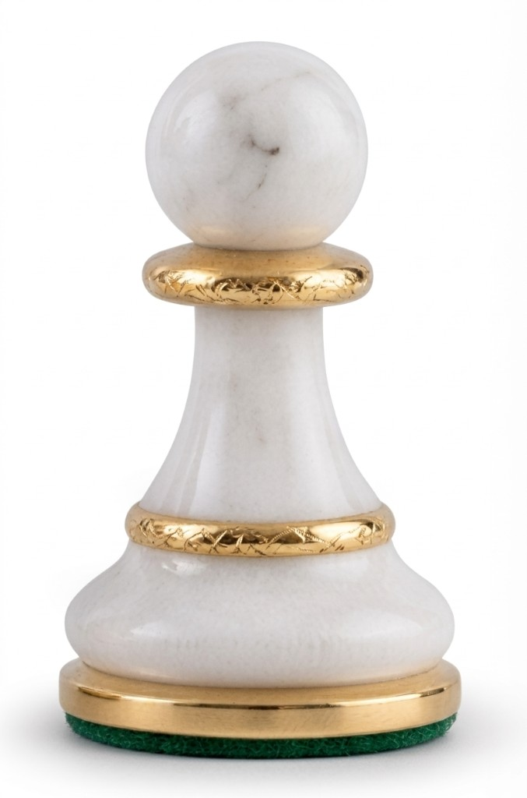

**Tour** — créneaux sertis d’émeraudes, collier d’or sous la couronne, bague tressée au-dessus du socle.

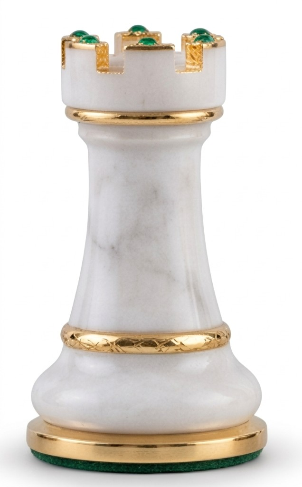

**Cavalier** — crinière, collier tressé, œil saphir.

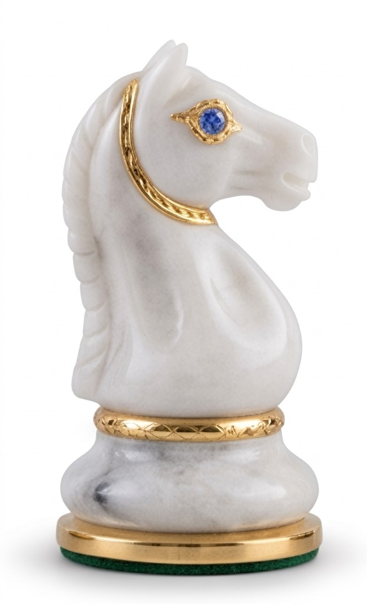

**Fou** — mitre fendue, couronne de rubis, deux anneaux d’or, bague ciselée.

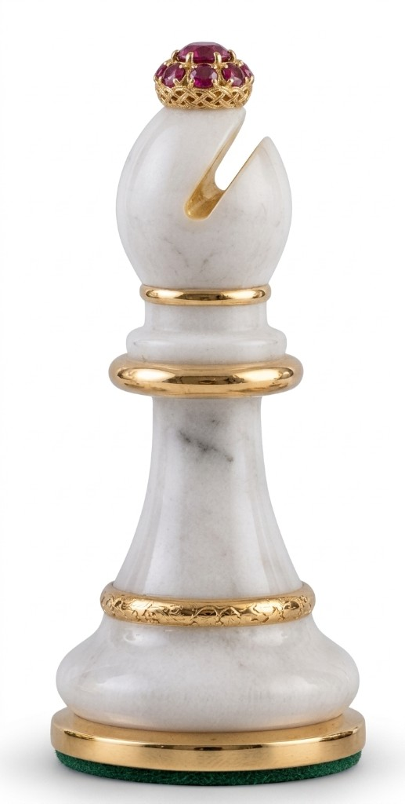

**Reine** — couronne à pointes et diamants, rang de brillants, bague ciselée.

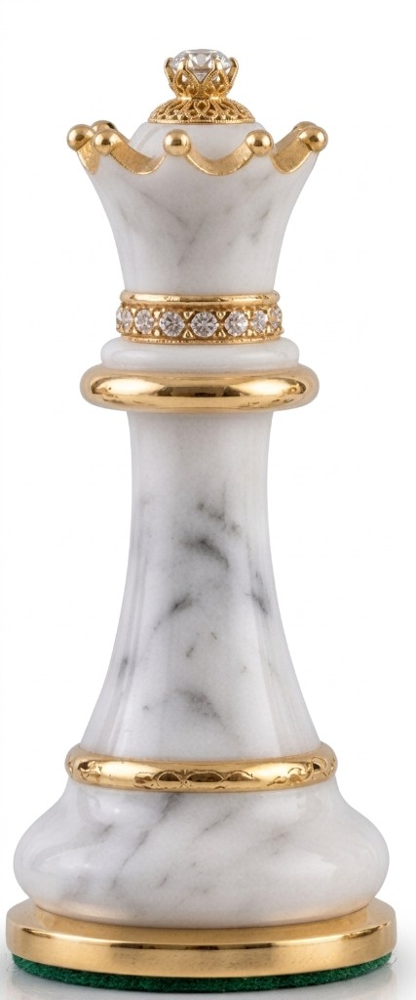

**Roi** — croix d’or à rubis, collier de saphirs, anneau lisse, bague ciselée.

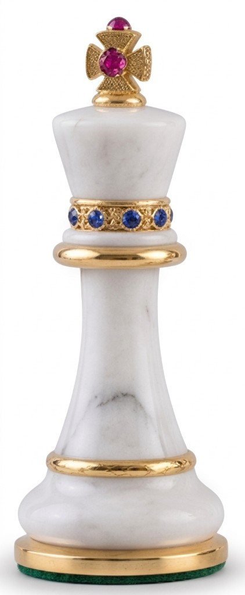

## Noirs

**Pion** — sphère sertie de diamants et de rubis, fût incrusté de lapis, de malachite et d’or.

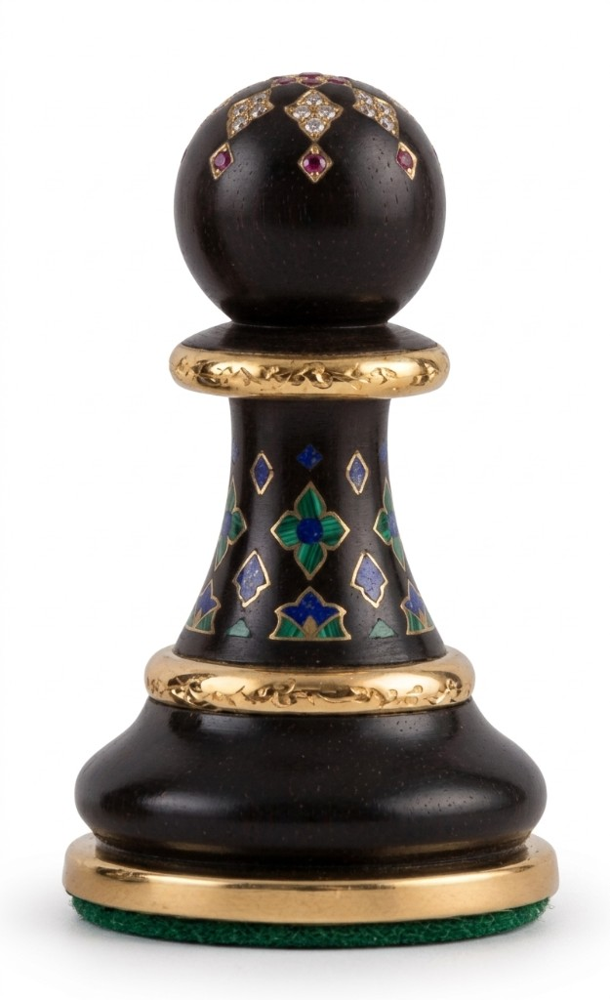

**Tour** — couronne d’or à émeraudes taillées, bague ciselée.

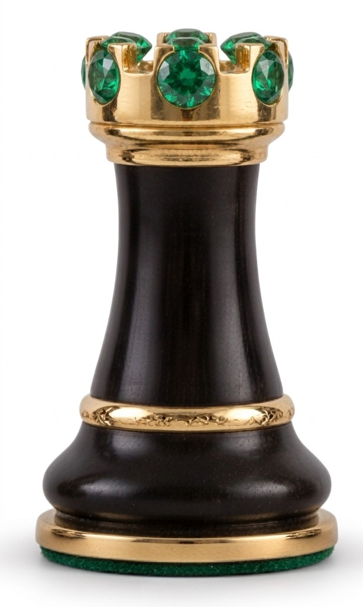

**Cavalier** — tête sculptée de rinceaux, crinière sertie, œil d’or.

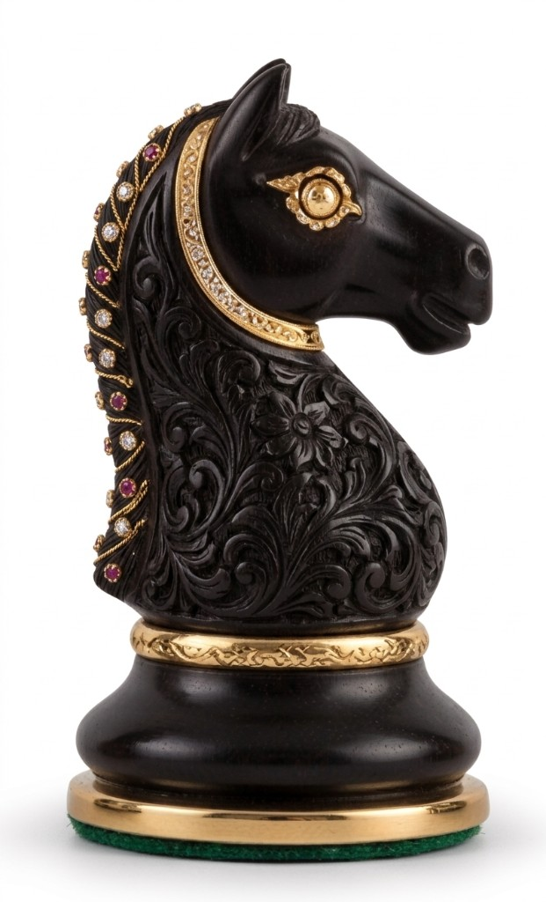

**Fou** — rubis sur la mitre, diamant dans la fente, bagues d’or.

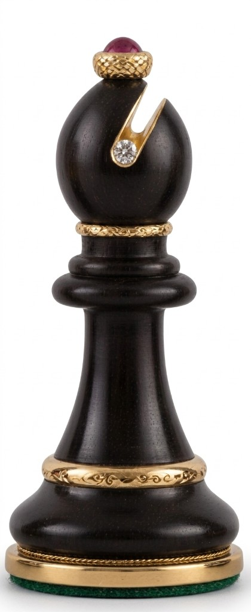

**Reine** — couronne d’or à diamants, collier de saphirs.

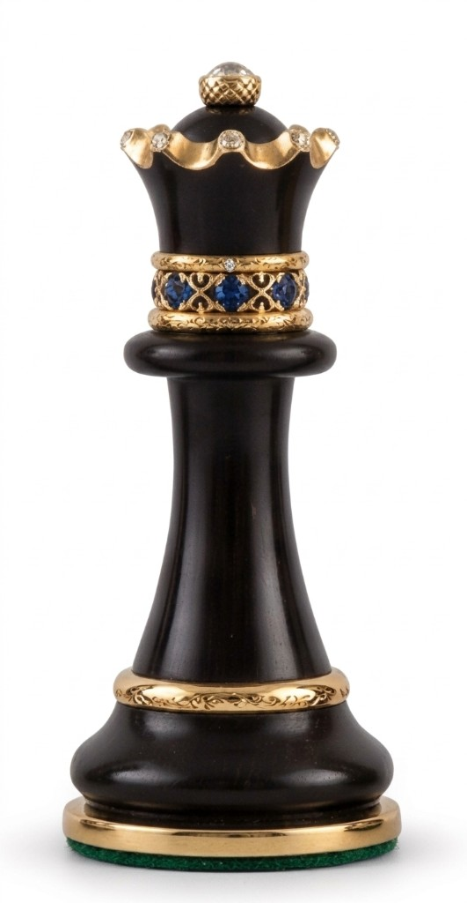

**Roi** — croix d’or à rubis, collier de rubis.

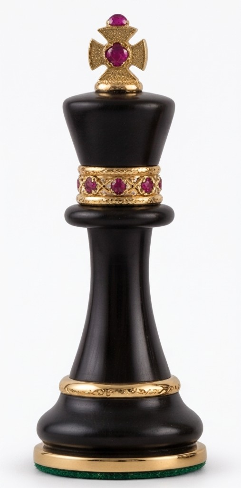
